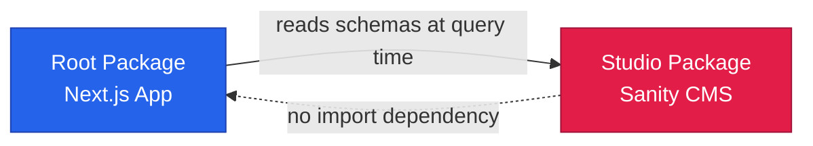

# Monorepo Workspace & Package Dependency Governance Rule

> **Rule ID**: `RULE-WORKSPACE-001`  
> **Project**: PT Daya Berkah Sentosa Nusantara (DBSN) — `arostech-hub`  
> **Monorepo Tool**: PNPM Workspaces (`pnpm-workspace.yaml`)  
> **Packages**: Root (`.`) + Studio (`studio/`)  
> **Owner Agent**: `typescript-reviewer` (type safety & dependency graph governance)  
> **Primary Authority**: [Versioning Policy](file:///d:/dev/arostech-hub/docs/engineering/governance/versioning-policy.md) & [Coding Standards](file:///d:/dev/arostech-hub/docs/engineering/governance/coding-standards.md)

---

## 1. File-Matcher Scopes

This rule MUST be enforced whenever an AI agent inspects or modifies files matching:

```
pnpm-workspace.yaml
pnpm-lock.yaml
package.json
studio/package.json
studio/schemas/**
studio/schemaTypes/**
turbo.json
scripts/**
```

Any file that modifies workspace membership, cross-package dependency declarations, or build orchestration is **in-scope** and MUST comply with all constraints in this rule.

---

## 2. Pre-Execution Architectural Vector Analysis

Before modifying workspace configurations or package dependencies, agents MUST evaluate the following 3 vectors:

1. **Vector A — Trade-offs & Isolation Dynamics**:
   - Monorepo packages MUST be decoupled. `studio` (Sanity Studio) defines schema design-time contracts; the main Next.js app consumes studio types via shared packages or relative imports, but MUST NOT bundle Studio runtime UI code into the main web bundle.
   - Maintain Cloudflare Pages 25 MB worker bundle budget limit across all workspace packages.

2. **Vector B — System Invariants & Spec Compliance**:
   - Intra-monorepo dependencies MUST use the PNPM `workspace:*` protocol (e.g. `"@arostech/studio": "workspace:*"`).
   - Enforce mandatory purge of unauthorized `@21st-sdk/*` packages (`@21st-sdk/agent`, `@21st-sdk/nextjs`, `@21st-sdk/node`, `@21st-sdk/react`).
   - Unidirectional build graph invariant: `studio` (independent design-time schemas) -> `src/` (main app).

3. **Vector C — Edge Cases & Verification Strategy**:
   - Detect circular workspace dependencies (`A -> B -> A`).
   - Prevent ghost dependencies (importing packages in subdirectories without declaring them in `package.json`).
   - Prevent `package-lock.json`, `npm-shrinkwrap.json`, or `yarn.lock` from polluting workspace member directories.

---

## 3. Normative Enforcement Rules (RFC 2119)

1. Cross-package dependencies within the repository **MUST** use the PNPM `workspace:*` protocol.
2. Packages matching `@21st-sdk/*` **MUST NOT** be added or imported anywhere in the monorepo and MUST be purged.
3. Build scripts **MUST** execute via PNPM / Turborepo obeying the build dependency graph.
4. Subpackages **MUST NOT** introduce circular references (`studio` MUST NOT import modules from `src/`).
5. All workspace directories **MUST** be explicitly listed in `pnpm-workspace.yaml`.
6. Workspace member directories **MUST NOT** contain `package-lock.json` or `yarn.lock` files; all lockfiles MUST defer to root `pnpm-lock.yaml`.

---

## 4. Workspace Structure & Dependency Graph

```
arostech-hub/                        # PNPM workspace root
├── pnpm-workspace.yaml               # sole workspace definition
├── pnpm-lock.yaml                    # ONLY lockfile permitted
├── package.json                      # root: Next.js 16 app
├── studio/
│   ├── package.json                  # Sanity Studio v3+
│   └── schemaTypes/                  # Sanity schema definitions (TS, imported at query time)
└── src/                              # Next.js app source (root package)
```



The dependency graph is **unidirectional**: the root package consumes Studio schema types at runtime; Studio MUST NOT import from the root package.

---

## 5. Explicit Forbidden Anti-Patterns

### ANTI-1: Circular Cross-Package Dependencies
```typescript
// studio/schemaTypes/product.ts — FORBIDDEN
import { someUtil } from '../../src/lib/utils' // FORBIDDEN: crosses package boundary backward
```
**Correct Pattern**: Studio schemas are consumed via `@sanity/client` GROQ queries at runtime, not via TypeScript import chains.

---

### ANTI-2: Hardcoding Version Strings for Local Monorepo Packages
```json
// ❌ FORBIDDEN in package.json
{
  "dependencies": {
    "website-studio": "1.0.0" // FORBIDDEN: Must use workspace:* protocol
  }
}
```
**Correct Pattern**: `"website-studio": "workspace:*"`

---

### ANTI-3: Adding Unauthorized Scope-Creep Packages (`@21st-sdk/*`)
```json
// ❌ FORBIDDEN in package.json
{
  "dependencies": {
    "@21st-sdk/agent": "^0.0.18",
    "@21st-sdk/react": "^0.0.18"
  }
}
```
**Correct Pattern**: Purge `@21st-sdk/*` completely; use native React components and standard AI SDKs.

---

### ANTI-4: `package-lock.json` in Workspace Members
```
studio/package-lock.json    # FORBIDDEN: delete immediately and gitignore
```
**Correct Pattern**: All dependency resolution is managed centrally via `pnpm-lock.yaml` at the workspace root.

---

### ANTI-5: Exceeding 25MB Total Worker Bundle Budget
```bash
# FORBIDDEN: Bundling native modules or heavy polyfills into worker output
```
**Correct Pattern**: Exclude heavy native packages using `allowBuilds` / `ignoredBuiltDependencies` in `pnpm-workspace.yaml`.

---

## 6. Approved Canonical Code Patterns

### CANONICAL-1: Workspace Protocol Dependency Specifier
```json
// root package.json or studio/package.json
{
  "dependencies": {
    "shared-types": "workspace:*"
  }
}
```

---

### CANONICAL-2: `pnpm-workspace.yaml` Package Specification
```yaml
# pnpm-workspace.yaml — CANONICAL
packages:
  - '.'          # root: Next.js application
  - 'studio'     # Sanity Studio CMS

# Native build filters to enforce 25MB worker budget limit
ignoredBuiltDependencies:
  - 'sharp'
  - 'unrs-resolver'
```

---

### CANONICAL-3: `turbo.json` Pipeline Specification
```json
{
  "$schema": "https://turbo.build/schema.json",
  "tasks": {
    "build": {
      "dependsOn": ["^build"],
      "outputs": [".next/**", "!.next/cache/**", ".vercel/output/**"]
    },
    "pages:build": {
      "dependsOn": ["build"],
      "outputs": [".vercel/output/**"]
    },
    "lint": {
      "outputs": []
    },
    "dev": {
      "cache": false,
      "persistent": true
    }
  }
}
```

---

## 7. Authoritative Build Order Specification

| Step | Command | Package Scope | Purpose |
|------|---------|---------------|---------|
| 1 | `pnpm install --frozen-lockfile` | Workspace Root | Resolve all workspace dependencies via PNPM |
| 2 | `pnpm generate` | Root (`.`) | Generate `@prisma/client` from `schema.prisma` |
| 3 | `pnpm build` | Root (`.`) | Next.js compilation & asset creation |
| 4 | `pnpm pages:build` | Root (`.`) | `@opennextjs/cloudflare` → `.open-next/assets` |
| — | `pnpm -F website-studio build` | Studio (`studio/`) | Independent; triggered separately for Studio deploy |

---

## 8. 25MB Worker Bundle Budget & Native Build Filters

The Cloudflare Pages edge worker deployment MUST NOT exceed **25 MB** total uncompressed bundle size.

### Native Dependency Restrictions
1. Native dependencies like `sharp` and `unrs-resolver` MUST be listed in `ignoredBuiltDependencies` in `pnpm-workspace.yaml`.
2. Post-build bundle size verification:
   ```bash
   du -sb .vercel/output/static/_worker.js
   # MUST be < 26214400 bytes (25 MB)
   ```

---

## 9. Residual Technical Debt & Remediation Plan

| Item | Current State | Required State | Priority |
|------|--------------|----------------|----------|
| Root `package.json` name | `"my-website"` | `"arostech-hub"` | LOW |
| `@21st-sdk/*` packages (×4) | Present in root dependencies | Removed entirely | HIGH |
| `studio/package-lock.json` | May exist | Deleted + gitignored | HIGH |
| Studio `package.json` module type | `"commonjs"` | Aligned with workspace ES modules | LOW |
