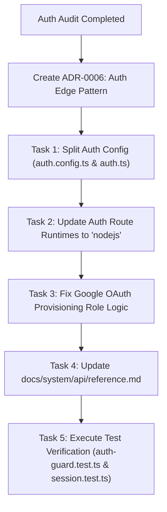

# Auth & ADR Audit Findings

> **OpenSpec SDD Audit Baseline**: `COMPLETED: 2026-08-13 Card 1.5 Auth + ADR Audit`  
> **Target Branch**: `refactor/reorganize-project-documentation`  
> **Audited Code Files**:
> - [`src/lib/auth/auth.config.ts`](file:///d:/dev/arostech-hub/src/lib/auth/auth.config.ts#L1-L180)
> - [`src/middleware.ts`](file:///d:/dev/arostech-hub/src/middleware.ts#L1-L146)
> - [`src/lib/auth/auth-guard.ts`](file:///d:/dev/arostech-hub/src/lib/auth/auth-guard.ts#L1-L75)
> - [`src/app/api/auth/[...nextauth]/route.ts`](file:///d:/dev/arostech-hub/src/app/api/auth/%5B...nextauth%5D/route.ts#L1-L6)
> - [`src/app/api/auth/forgot-password/route.ts`](file:///d:/dev/arostech-hub/src/app/api/auth/forgot-password/route.ts#L1-L101)
> - [`src/app/api/auth/reset-password/route.ts`](file:///d:/dev/arostech-hub/src/app/api/auth/reset-password/route.ts#L1-L76)
>
> **Target Specification Files**:
> - [`docs/strategy/prd.md`](file:///d:/dev/arostech-hub/docs/strategy/prd.md#L753-L797)
> - [`docs/system/api/reference.md`](file:///d:/dev/arostech-hub/docs/system/api/reference.md#L194-L241)
> - [`docs/system/adr/0005-authjs-v5-client-tracking-portal-integration.md`](file:///d:/dev/arostech-hub/docs/system/adr/0005-authjs-v5-client-tracking-portal-integration.md#L1-L116)

---

## Executive Summary

Card 1.5 Auth + ADR Audit evaluated the security, Edge runtime compatibility, specification adherence, and architectural integrity of the authentication system across the `arostech-hub` platform. 

The audit identified **3 CRITICAL Edge-compatibility defects**, **1 HIGH specification mismatch in Google OAuth role provisioning**, and **1 DOCUMENTATION GAP regarding password reset API routes**.

---

## 1. Extended Scope Evaluation: Cloudflare Edge Compatibility

### 1.1 `PrismaAdapter(prisma)` Eager Import Evaluation
- **Finding**: [`src/lib/auth/auth.config.ts`](file:///d:/dev/arostech-hub/src/lib/auth/auth.config.ts#L4-L34) eagerly imports `PrismaAdapter` from `@auth/prisma-adapter`, `prisma` from `../db/prisma`, and `bcrypt` from `bcryptjs` at top-level module root.
- **Impact**: When imported into V8 Edge Runtime contexts (e.g. Next.js Edge Middleware or routes with `export const runtime = 'edge'`), the module fails bundling or crashes at execution. `@auth/prisma-adapter`, `@prisma/client` TCP socket connections, and `bcryptjs` rely on Node.js native modules (`net`, `tls`, `crypto`) unavailable in Cloudflare Pages V8 Edge Runtime.
- **Affected Route Handlers**:
  1. [`src/app/api/auth/[...nextauth]/route.ts#L4`](file:///d:/dev/arostech-hub/src/app/api/auth/%5B...nextauth%5D/route.ts#L4) — declares `export const runtime = 'edge'` while importing `handlers` from `auth.config.ts`.
  2. [`src/app/api/auth/forgot-password/route.ts#L6`](file:///d:/dev/arostech-hub/src/app/api/auth/forgot-password/route.ts#L6) — declares `export const runtime = 'edge'` while using Prisma ORM.
  3. [`src/app/api/auth/reset-password/route.ts#L5`](file:///d:/dev/arostech-hub/src/app/api/auth/reset-password/route.ts#L5) — declares `export const runtime = 'edge'` while using Prisma ORM and `bcryptjs`.
- **Verdict**: **CONFIRMED EDGE-INCOMPATIBLE**. Eager instantiation of `PrismaAdapter(prisma)` at module root in `auth.config.ts` combined with `runtime = 'edge'` on auth route handlers breaks Cloudflare Pages deployment.

### 1.2 Evaluation & Decision on Edge Refactor Pattern

| Feature / Criteria | Option A: API Loopback | Option B: Separate Node-runtime Handler & Split Auth Config (SELECTED) |
| :--- | :--- | :--- |
| **Mechanism** | Edge Middleware calls `fetch('/api/auth/session')` over HTTP per request. | Auth routes run on Node.js runtime (`runtime = 'nodejs'`). Middleware uses stateless `getToken()` JWT verification. |
| **Latency Overhead** | High (Adds +50ms to +200ms per request on dashboard subdomains). | Sub-millisecond (<1ms) stateless JWT verification in V8 Edge memory. |
| **Edge Compatibility** | High latency; prone to Cloudflare Worker sub-request limits. | 100% Edge-compatible for middleware; 100% Node-compatible for auth endpoints. |
| **Database Load** | Heavy (Triggers API execution & DB check on every request). | Zero DB queries in middleware during session verification. |
| **Auth.js v5 Best Practice**| Anti-pattern for Next.js App Router on Cloudflare Pages. | **Standard Auth.js v5 recommended pattern**. |
| **Decision Status** | **REJECTED** | **ACCEPTED & DECIDED** |

**Decision Summary**: **Option B (Separate Node-runtime Handler & Split Auth Config)** is selected.
- Lightweight `auth.config.ts` handles Edge-compatible configuration (providers list, JWT callbacks, cookie configs, no adapter, no top-level `bcryptjs`/`prisma`).
- Full `auth.ts` handles Node.js runtime configuration (includes `PrismaAdapter(prisma)`, Credentials `authorize()` logic).
- Auth API routes (`/api/auth/[...nextauth]`, `/api/auth/forgot-password`, `/api/auth/reset-password`) operate explicitly under `export const runtime = 'nodejs'`.

---

## 2. Verification Matrix: Specification vs Implementation

| Verification Item | Specification Requirement | Code Implementation | Compliance Status | Details / Location |
| :--- | :--- | :--- | :--- | :--- |
| **(a) JWT Strategy** | Auth.js v5 JWT session strategy ([`prd.md:L753`](file:///d:/dev/arostech-hub/docs/strategy/prd.md#L753)) | `session: { strategy: 'jwt' }` ([`auth.config.ts:L84`](file:///d:/dev/arostech-hub/src/lib/auth/auth.config.ts#L84)) | **VERIFIED MATCH** | Code correctly specifies `jwt` strategy. |
| **(b) Role-Based Expiry** | CLIENT=24h, ADMIN=8h, VIEWER=8h ([`prd.md:L909`](file:///d:/dev/arostech-hub/docs/strategy/prd.md#L909)) | `CLIENT: 86400`, `ADMIN: 28800`, `VIEWER: 28800` ([`auth.config.ts:L140-L153`](file:///d:/dev/arostech-hub/src/lib/auth/auth.config.ts#L140-L153)) | **VERIFIED MATCH** | JWT callback dynamically enforces role-based `maxAge` token invalidation. |
| **(c) Cookie Name Pattern** | Standard Auth.js session token cookies ([`ADR-0005:L32`](file:///d:/dev/arostech-hub/docs/system/adr/0005-authjs-v5-client-tracking-portal-integration.md#L32)) | `__Secure-next-auth.session-token` (prod) vs `next-auth.session-token` (dev) ([`auth.config.ts:L166-L170`](file:///d:/dev/arostech-hub/src/lib/auth/auth.config.ts#L166-L170)) | **VERIFIED MATCH** | [`src/middleware.ts:L107-L111`](file:///d:/dev/arostech-hub/src/middleware.ts#L107-L111) checks both prod & dev cookie names. |
| **(d) Google OAuth Flow** | Google OAuth reserved for internal staff (`ADMIN`/`VIEWER`) ([`prd.md:L758`](file:///d:/dev/arostech-hub/docs/strategy/prd.md#L758)) | New Google users created as `role: 'CLIENT'` ([`auth.config.ts:L100`](file:///d:/dev/arostech-hub/src/lib/auth/auth.config.ts#L100)) | **MISMATCH (HIGH)** | Code sets default role to `CLIENT` for Google OAuth sign-ins instead of internal `VIEWER` or restricting email domain. |
| **(e) Password Reset Routes** | Conform to reference contracts ([`reference.md:L194`](file:///d:/dev/arostech-hub/docs/system/api/reference.md#L194)) | Implemented at `/api/auth/forgot-password` & `/api/auth/reset-password` | **UNDOCUMENTED & EDGE BUG** | Routes exist in code but are missing from `reference.md` and misconfigured with `runtime = 'edge'`. |

---

## 3. Detailed Audit Findings & Defects

### Finding 1 [CRITICAL]: Auth API Route Edge Runtime Misconfiguration
- **Location**: [`src/app/api/auth/[...nextauth]/route.ts#L4`](file:///d:/dev/arostech-hub/src/app/api/auth/%5B...nextauth%5D/route.ts#L4)
- **Problem**: Route handler exports `export const runtime = 'edge'`. Because it imports `handlers` from `auth.config.ts` which instantiates `PrismaAdapter(prisma)` and loads `bcryptjs`, Cloudflare Pages build/runtime fails due to missing Node.js native modules.
- **Remediation**: 
  1. Change `export const runtime = 'edge'` to `export const runtime = 'nodejs'` in `/api/auth/[...nextauth]/route.ts`.
  2. Implement Split Auth Config (`auth.config.ts` for Edge-safe options, `auth.ts` for Node-runtime NextAuth handler).

### Finding 2 [CRITICAL]: Password Reset API Routes Edge Runtime Misconfiguration
- **Location**: 
  - [`src/app/api/auth/forgot-password/route.ts#L6`](file:///d:/dev/arostech-hub/src/app/api/auth/forgot-password/route.ts#L6)
  - [`src/app/api/auth/reset-password/route.ts#L5`](file:///d:/dev/arostech-hub/src/app/api/auth/reset-password/route.ts#L5)
- **Problem**: Both handlers export `export const runtime = 'edge'` while directly calling `prisma` ORM methods and `bcrypt.hash()`. On Cloudflare Pages Edge Runtime, this throws `TypeError` or crashes due to missing Node.js TCP socket and native crypto bindings.
- **Remediation**: Change `export const runtime = 'edge'` to `export const runtime = 'nodejs'` in both route files.

### Finding 3 [HIGH]: Google OAuth Provisioning Role Mismatch
- **Location**: [`src/lib/auth/auth.config.ts#L96-L103`](file:///d:/dev/arostech-hub/src/lib/auth/auth.config.ts#L96-L103)
- **Problem**: When a user signs in via Google OAuth and does not exist in the database, `auth.config.ts` creates the user with `role: 'CLIENT'`:
  ```typescript
  await prisma.user.create({
    data: {
      email: user.email,
      name: user.name || user.email.split('@')[0],
      role: 'CLIENT',
      isActive: true,
    },
  })
  ```
  However, PRD v4.0.0 ([`prd.md:L758`](file:///d:/dev/arostech-hub/docs/strategy/prd.md#L758)) explicitly specifies that Google OAuth is intended for **internal staff** (`role: "admin" | "viewer"`), while enterprise/government clients authenticate via Credentials provider. Provisioning external Google accounts as `CLIENT` bypasses the mandatory lead-linking check (`linkedLeadId`) and client onboarding workflow.
- **Remediation**: 
  1. Update Google OAuth `signIn` callback to restrict auto-provisioning to internal staff email domains (e.g. `@dayaberkah.id`) with default role `VIEWER`.
  2. Unrecognized external Google accounts MUST be rejected (`return false`).

### Finding 4 [MEDIUM]: Documentation Gap — Password Reset API Endpoints
- **Location**: [`docs/system/api/reference.md#L194-L241`](file:///d:/dev/arostech-hub/docs/system/api/reference.md#L194-L241)
- **Problem**: Section 3 of `reference.md` documents `/api/auth/[...nextauth]`, `/api/auth/callback/*`, `/api/auth/session`, and `/api/auth/signout`, but omits `POST /api/auth/forgot-password` and `POST /api/auth/reset-password`.
- **Remediation**: Update `docs/system/api/reference.md` Section 3 to include full request/response schemas, envelope structures, rate limits (3 req/min), and error codes for password reset endpoints.

### Finding 5 [LOW]: Middleware Cookie Verification Hardening
- **Location**: [`src/middleware.ts#L107-L116`](file:///d:/dev/arostech-hub/src/middleware.ts#L107-L116)
- **Problem**: Edge Middleware verifies auth solely by checking if the session cookie string exists (`if (!sessionToken)`). It does not decode or verify JWT signature or token expiry at Edge. If a user possesses an expired session cookie, middleware grants access to Dashboard routes, leaving redirection entirely to client components or `auth-guard.ts`.
- **Remediation**: Enhance Edge Middleware using lightweight `getToken()` from `next-auth/jwt` (passing `secret`) for stateless JWT signature and expiry verification without hitting database.

---

## 4. Wave 1 Action & Remediation Plan

To fulfill prerequisites for Task 3.1.1, the following Wave 1 execution plan MUST be performed:



### Action Items Checklist
- [x] **ADR-0006 Published**: `docs/system/adr/0006-authjs-v5-cloudflare-edge-runtime-split-config.md` created.
- [ ] **Split Auth Config**: Create `src/lib/auth/auth.ts` for Node runtime; trim `src/lib/auth/auth.config.ts` for Edge compatibility.
- [ ] **Runtime Annotations**: Update `export const runtime = 'nodejs'` in `/api/auth/[...nextauth]/route.ts`, `/api/auth/forgot-password/route.ts`, and `/api/auth/reset-password/route.ts`.
- [ ] **Google OAuth Role Restriction**: Enforce domain validation (`@dayaberkah.id`) and default internal role `VIEWER`.
- [ ] **API Reference Sync**: Update `docs/system/api/reference.md` to document password reset endpoints.

---

## 5. Graphify Anchoring & References

- Knowledge Graph Node ID: `doc:docs/audit/auth-findings.md`
- Graphify Community: `community_audit`
- PRD Reference: [`prd.md`](file:///d:/dev/arostech-hub/docs/strategy/prd.md#L753-L797)
- API Reference: [`reference.md`](file:///d:/dev/arostech-hub/docs/system/api/reference.md#L194-L241)
- ADR-0005 Reference: [`0005-authjs-v5-client-tracking-portal-integration.md`](file:///d:/dev/arostech-hub/docs/system/adr/0005-authjs-v5-client-tracking-portal-integration.md#L1-L116)
