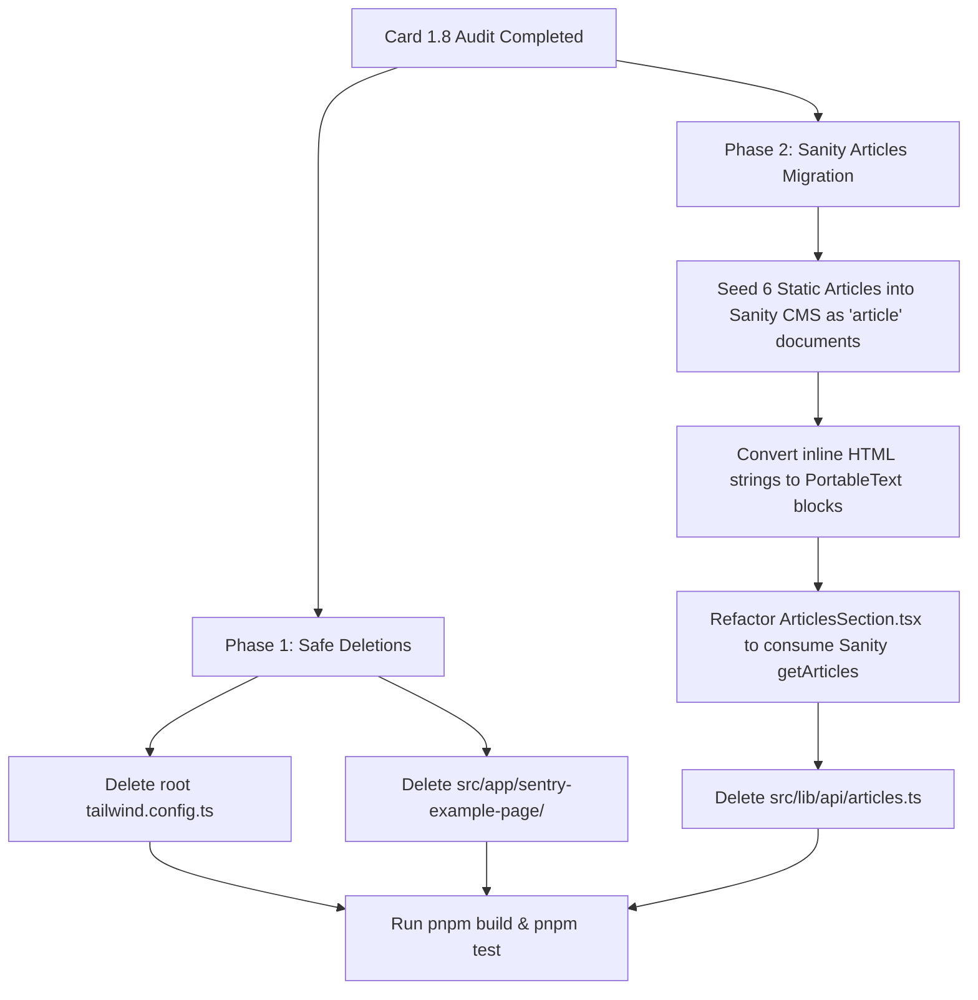

# Card 1.8 Dead Code Audit Findings Report

> **Audit Date**: 2026-08-13  
> **Target Repository**: `d:/dev/arostech-hub`  
> **Branch**: `refactor/reorganize-project-documentation`  
> **Audit Scope**:
> - `tailwind.config.ts` (Root directory, 54 lines)
> - `src/app/sentry-example-page/` ([`page.tsx`](file:///d:/dev/arostech-hub/src/app/sentry-example-page/page.tsx), 133 lines)
> - `src/lib/api/articles.ts` ([`articles.ts`](file:///d:/dev/arostech-hub/src/lib/api/articles.ts), 174 lines)
> **Output Artifact**: [`docs/audit/dead-code-findings.md`](file:///d:/dev/arostech-hub/docs/audit/dead-code-findings.md)

---

## 1. Executive Summary

This audit evaluates the dead code surface of the `arostech-hub` repository to identify unused legacy configuration, orphaned developer testing artifacts, and hardcoded content modules. Each item in scope has been scanned for active imports, route dependencies, caller references, and architectural alignment against the PRD and Tailwind v4 CSS-first paradigm.

### Key Audit Findings

1. **`tailwind.config.ts` (SAFE TO DELETE - LOW RISK)**:
   The root [`tailwind.config.ts`](file:///d:/dev/arostech-hub/tailwind.config.ts#L1-L54) is a legacy Tailwind CSS v3 configuration file. The project operates on Tailwind CSS v4 (`@tailwindcss/postcss: ^4`, `tailwindcss: ^4` in [`package.json`](file:///d:/dev/arostech-hub/package.json#L78-L97)) using CSS-first configuration via `@import "tailwindcss";` and `@theme` directives in [`src/app/globals.css`](file:///d:/dev/arostech-hub/src/app/globals.css#L1-L64). Codebase import scan confirmed **zero code consumers** import or reference this file.
2. **`sentry-example-page/` (SAFE TO DELETE - LOW RISK)**:
   The route [`src/app/sentry-example-page/page.tsx`](file:///d:/dev/arostech-hub/src/app/sentry-example-page/page.tsx#L1-L133) is an unlinked developer testing page generated during `@sentry/nextjs` setup. Static analysis confirms it is **not linked** from any navigation bar, footer, header, sitemap, or router middleware. Furthermore, its server-side test button attempts to invoke `/api/sentry-example-api`, which does not exist in the codebase.
3. **`src/lib/api/articles.ts` (REQUIRES MIGRATION FIRST - MEDIUM RISK)**:
   [`src/lib/api/articles.ts`](file:///d:/dev/arostech-hub/src/lib/api/articles.ts#L1-L174) contains 174 lines of inline HTML across 6 hardcoded `Article` objects (`a1` to `a6`). Analysis reveals a caller split:
   - Hub dynamic article pages ([`src/app/(hub)/articles/page.tsx`](file:///d:/dev/arostech-hub/src/app/(hub)/articles/page.tsx#L1) and [`src/app/(hub)/articles/[slug]/page.tsx`](file:///d:/dev/arostech-hub/src/app/(hub)/articles/[slug]/page.tsx#L1)) **already consume Sanity CMS** via `getArticles()` and `getArticleBySlug()` in [`src/lib/api/sanity/queries.ts`](file:///d:/dev/arostech-hub/src/lib/api/sanity/queries.ts#L434-L528).
   - Homepage article section ([`src/components/sections/ArticlesSection.tsx`](file:///d:/dev/arostech-hub/src/components/sections/ArticlesSection.tsx#L18)) still imports the hardcoded static `articles` array directly.
   - Deleting `articles.ts` immediately without refactoring `ArticlesSection.tsx` would break the homepage build.

---

## 2. Removability Risk Matrix

| File / Component | Scope Location | Lines / Size | Current Usage / Callers | Removability Risk | Dependency / Migration Blockers | Action Required |
| :--- | :--- | :--- | :--- | :--- | :--- | :--- |
| **`tailwind.config.ts`** | `tailwind.config.ts` | 54 lines (1.2 KB) | 0 code callers. Legacy v3 config. | 🟢 **LOW (SAFE TO DELETE)** | None. Tailwind v4 theme is in `globals.css`. | Delete file in scope cleanup. |
| **`sentry-example-page/`** | `src/app/sentry-example-page/page.tsx` | 133 lines (6.2 KB) | 0 navigation, sitemap, or router links. Unlinked dev artifact. | 🟢 **LOW (SAFE TO DELETE)** | None. Calls non-existent API `/api/sentry-example-api`. | Delete directory `sentry-example-page/`. |
| **`articles.ts`** | `src/lib/api/articles.ts` | 174 lines (13.8 KB) | Direct dependency in [`ArticlesSection.tsx`](file:///d:/dev/arostech-hub/src/components/sections/ArticlesSection.tsx#L18). | 🟡 **MEDIUM (MIGRATE FIRST)** | [`ArticlesSection.tsx`](file:///d:/dev/arostech-hub/src/components/sections/ArticlesSection.tsx#L18) imports static `articles`. | Seed 6 articles into Sanity CMS, update `ArticlesSection.tsx` to call Sanity GROQ query, then delete file. |

---

## 3. Deep Dive Analysis by Scope Target

### 3.1 `tailwind.config.ts` Audit

- **File Path**: [`file:///d:/dev/arostech-hub/tailwind.config.ts`](file:///d:/dev/arostech-hub/tailwind.config.ts#L1-L54)
- **Content Analysis**:
  Contains a Tailwind CSS v3 JavaScript/TypeScript configuration object (`Config`) specifying content paths (`./src/**/*.{js,ts,jsx,tsx}`, `./src/components/**/*.{js,ts,jsx,tsx}`) and theme extensions for colors (`primary`, `secondary`, `accent`, `background`, `foreground`, `muted`, `card`, `border`), custom spacing scales (`xs` through `3xl`), border radii (`sm`, `md`, `lg`), font families (`sans`, `serif`, `mono`), and max widths (`xs` through `3xl`).
- **Codebase Import Scan**:
  A global search across the entire project confirmed **zero code references** or TypeScript/JavaScript imports of `tailwind.config.ts` or `tailwind.config.js`.
  The only occurrences of `tailwind.config` in the workspace are:
  - Architectural documentation & migration plans ([`SYSTEM_BLUEPRINT_MIGRATION_PLAN_v2.md`](file:///d:/dev/arostech-hub/SYSTEM_BLUEPRINT_MIGRATION_PLAN_v2.md#L44))
  - Agent rule files ([`.agents/rules/tailwind-v4.md`](file:///d:/dev/arostech-hub/.agents/rules/tailwind-v4.md#L9))
  - Internal agent prompts ([`.agents/agents/react-build-resolver/agent.md`](file:///d:/dev/arostech-hub/.agents/agents/react-build-resolver/agent.md#L189))
  - Graphify index files ([`graphify-out/GRAPH_REPORT.md`](file:///d:/dev/arostech-hub/graphify-out/GRAPH_REPORT.md#L455))
- **Tailwind v4 Alignment**:
  Tailwind v4 uses CSS-first configuration via `@import "tailwindcss";` and `@theme` blocks inside [`src/app/globals.css`](file:///d:/dev/arostech-hub/src/app/globals.css#L1-L64). Standard Next.js + `@tailwindcss/postcss` build processes ignore `tailwind.config.ts` unless explicitly configured via CSS `@config` directives (which are not used in `globals.css`).
- **Verdict**: **SAFE TO DELETE**.

---

### 3.2 `src/app/sentry-example-page/` Audit

- **File Path**: [`file:///d:/dev/arostech-hub/src/app/sentry-example-page/page.tsx`](file:///d:/dev/arostech-hub/src/app/sentry-example-page/page.tsx#L1-L133)
- **Content Analysis**:
  A Client Component (`'use client'`) titled "Sentry Diagnostic Portal". Contains two action handlers:
  1. `triggerClientError()`: Throws a raw browser JavaScript `Error('Sentry Example Client-Side Error...')`.
  2. `triggerApiError()`: Performs `fetch('/api/sentry-example-api')` to trigger a server exception.
- **Route & Navigation Verification**:
  - **Navigation**: Scanned all navigation components ([`Header.tsx`](file:///d:/dev/arostech-hub/src/components/layout/Header.tsx), [`Footer.tsx`](file:///d:/dev/arostech-hub/src/components/layout/Footer.tsx), [`Sidebar.tsx`](file:///d:/dev/arostech-hub/src/components/layout/Sidebar.tsx)). Zero links point to `/sentry-example-page`.
  - **Sitemap**: Excluded from dynamic and static sitemap routines (`sitemap.ts`).
  - **Router & Middleware**: Not referenced in Next.js middleware, domain routing, or redirect tables ([`src/lib/middleware/redirect-engine.ts`](file:///d:/dev/arostech-hub/src/lib/middleware/redirect-engine.ts)).
  - **Dangling Endpoint**: The route Handler calls `/api/sentry-example-api`, which does not exist anywhere in `src/app/api/` (returns 404).
- **Security & Scope Risk**:
  Exposing unauthenticated diagnostic error-triggering endpoints in production builds introduces noise into error monitoring tools (Sentry) and increases the attack/reconnaissance surface.
- **Verdict**: **SAFE TO DELETE**.

---

### 3.3 `src/lib/api/articles.ts` Audit

- **File Path**: [`file:///d:/dev/arostech-hub/src/lib/api/articles.ts`](file:///d:/dev/arostech-hub/src/lib/api/articles.ts#L1-L174)
- **Content Analysis**:
  Contains 174 lines of inline HTML content embedded within 6 static JavaScript objects (`a1` through `a6`) of type `Article`:
  - `a1`: `"tren-pju-tenaga-surya-2024-smart-city"`
  - `a2`: `"panduan-pengadaan-lkpp-e-katalog-vendor"`
  - `a3`: `"pentingnya-tkdn-infrastruktur-indonesia"`
  - `a4`: `"perbandingan-panel-surya-monocrystalline-polycrystalline"`
  - `a5`: `"standar-sni-penangkal-petir-perlindungan-bangunan"`
  - `a6`: `"battery-energy-storage-system-bess-indonesia"`
- **Caller Trace & Dependency Graph**:
  ```
  src/lib/api/articles.ts (Static Array)
       │
       ├──► src/components/sections/ArticlesSection.tsx (IMPORTS & RENDERS STATIC ARTICLES)
       │
  src/lib/api/sanity/queries.ts (GROQ Query Engine)
       │
       ├──► src/app/(hub)/articles/page.tsx (USES getArticles())
       └──► src/app/(hub)/articles/[slug]/page.tsx (USES getArticleBySlug())
  ```
  - **Consumer 1**: [`src/components/sections/ArticlesSection.tsx`](file:///d:/dev/arostech-hub/src/components/sections/ArticlesSection.tsx#L18) imports `articles` directly from `@/lib/api/articles`. It powers the interactive article preview carousel on the main landing page.
  - **Consumer 2 & 3**: [`src/app/(hub)/articles/page.tsx`](file:///d:/dev/arostech-hub/src/app/(hub)/articles/page.tsx#L1) and [`src/app/(hub)/articles/[slug]/page.tsx`](file:///d:/dev/arostech-hub/src/app/(hub)/articles/[slug]/page.tsx#L1) **do NOT use `articles.ts`**. They query Sanity CMS directly via GROQ query functions `getArticles()` and `getArticleBySlug()` in [`src/lib/api/sanity/queries.ts`](file:///d:/dev/arostech-hub/src/lib/api/sanity/queries.ts#L434-L528).
- **Sanity CMS Query & Type Alignment**:
  - `queries.ts` **ALREADY HAS** full Sanity GROQ query implementations for `article`:
    - `getArticles()` (queries `*[_type == "article"]`)
    - `getArticleBySlug(slug: string)` (queries `*[_type == "article" && slug.current == $slug][0]`)
    - `getArticleSlugs()` (queries `*[_type == "article" && defined(slug.current)]`)
  - `types.ts` **ALREADY HAS** TypeScript interface definitions for `Article` and `ArticleWithRelations`:
    - `content` field in Sanity is structured as `PortableTextBlock[]` (processed via `@portabletext/react` in `[slug]/page.tsx`), whereas `articles.ts` stores `content` as raw HTML strings.
- **Verdict**: **REQUIRES MIGRATION FIRST**. `articles.ts` cannot be deleted until `ArticlesSection.tsx` is updated to fetch from Sanity CMS or receive Sanity articles as props.

---

## 4. Behavioral Contracts & Verification Scenarios

### Requirement: Dead Code Elimination Safety Contract
All code files marked for deletion SHALL have zero active references across runtime code, build scripts, middleware, and navigation systems.

#### Scenario 1: Deletion of Tailwind Config Legacy File
- **GIVEN** the codebase runs on Tailwind CSS v4 with CSS-first configuration in [`src/app/globals.css`](file:///d:/dev/arostech-hub/src/app/globals.css#L1-L64)
- **WHEN** `tailwind.config.ts` is deleted from root
- **THEN** Next.js build (`pnpm build`) and Cloudflare Pages build (`pnpm pages:build`) MUST compile successfully without CSS compilation errors or missing utility classes.

#### Scenario 2: Deletion of Unlinked Sentry Diagnostic Route
- **GIVEN** `src/app/sentry-example-page/` is an unlinked developer testing page
- **WHEN** the directory `src/app/sentry-example-page/` is removed
- **THEN** no broken internal links, sitemap entries, or router module import errors SHALL be produced.

#### Scenario 3: Migration and Deletion of Hardcoded Articles
- **GIVEN** `src/lib/api/articles.ts` is imported by [`ArticlesSection.tsx`](file:///d:/dev/arostech-hub/src/components/sections/ArticlesSection.tsx#L18)
- **WHEN** the 6 static articles are seeded into Sanity CMS under `_type: "article"` AND [`ArticlesSection.tsx`](file:///d:/dev/arostech-hub/src/components/sections/ArticlesSection.tsx#L18) is refactored to consume Sanity query results
- **THEN** `src/lib/api/articles.ts` SHALL be deleted, resulting in zero static inline HTML content files in `src/lib/api/`.

---

## 5. Migration Strategy & Step-by-Step Implementation Path



### Step 1: Immediate Safe Deletions (Wave 3.5.1)
1. Delete `tailwind.config.ts` at project root.
2. Delete directory `src/app/sentry-example-page/`.
3. Run `pnpm build` and `pnpm test` to verify zero build regressions.

### Step 2: Articles Migration to Sanity CMS (Wave 3.3.2)
1. **CMS Data Seeding**:
   Create a seed script or studio mutation to import the 6 articles (`a1` to `a6`) into Sanity CMS with `_type: "article"`. Convert raw HTML paragraphs/headings into standard Sanity `PortableTextBlock` structures.
2. **Component Refactoring**:
   Update [`src/components/sections/ArticlesSection.tsx`](file:///d:/dev/arostech-hub/src/components/sections/ArticlesSection.tsx#L18):
   - Change component signature to accept `articles?: ArticleWithRelations[]` as a prop.
   - Alternatively, convert `ArticlesSection.tsx` or parent container into an async Server Component that fetches `await getArticles()` directly from `@/lib/api/sanity/queries`.
   - Provide an empty array / fallback state (`articles || []`) when Sanity CMS is unreachable.
3. **Legacy Cleanup**:
   Delete `src/lib/api/articles.ts` once zero references to `@/lib/api/articles` remain in `src/`.

---

## 6. Authoritative Specifications & OpenSpec Delta

```
ADDED: docs/audit/dead-code-findings.md (Card 1.8 Dead Code Audit Report)
MODIFIED: SYSTEM_BLUEPRINT_MIGRATION_PLAN_v2.md (Updated Task 1.8 & 3.5.1 status to COMPLETED)
REMOVED (Targeted in Wave 3): tailwind.config.ts, src/app/sentry-example-page/page.tsx, src/lib/api/articles.ts
```

---

## 7. Next Steps & Execution Roadmap

1. **Wave 3.5.1 Scope Clean**:
   Execute deletion of `tailwind.config.ts` and `src/app/sentry-example-page/`.
2. **Wave 3.3.2 Article Migration**:
   Perform Sanity CMS article seeding and refactor [`ArticlesSection.tsx`](file:///d:/dev/arostech-hub/src/components/sections/ArticlesSection.tsx#L18) before deleting `src/lib/api/articles.ts`.
3. **Graphify Knowledge Graph Sync**:
   Execute `graphify update .` to update graph nodes following file deletions.
