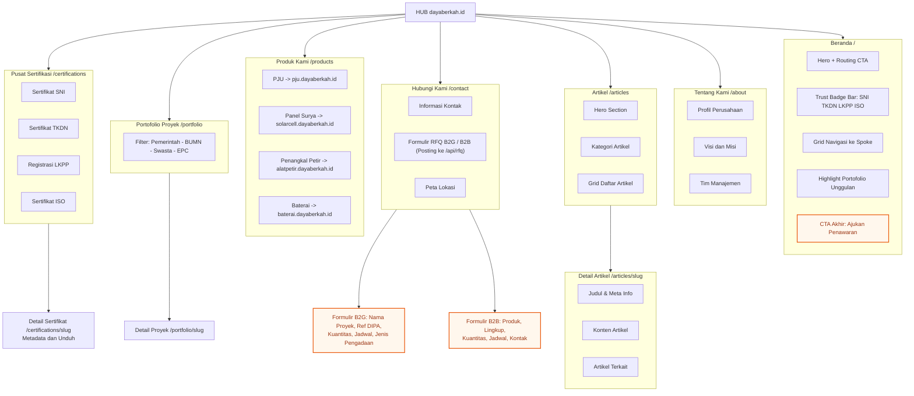
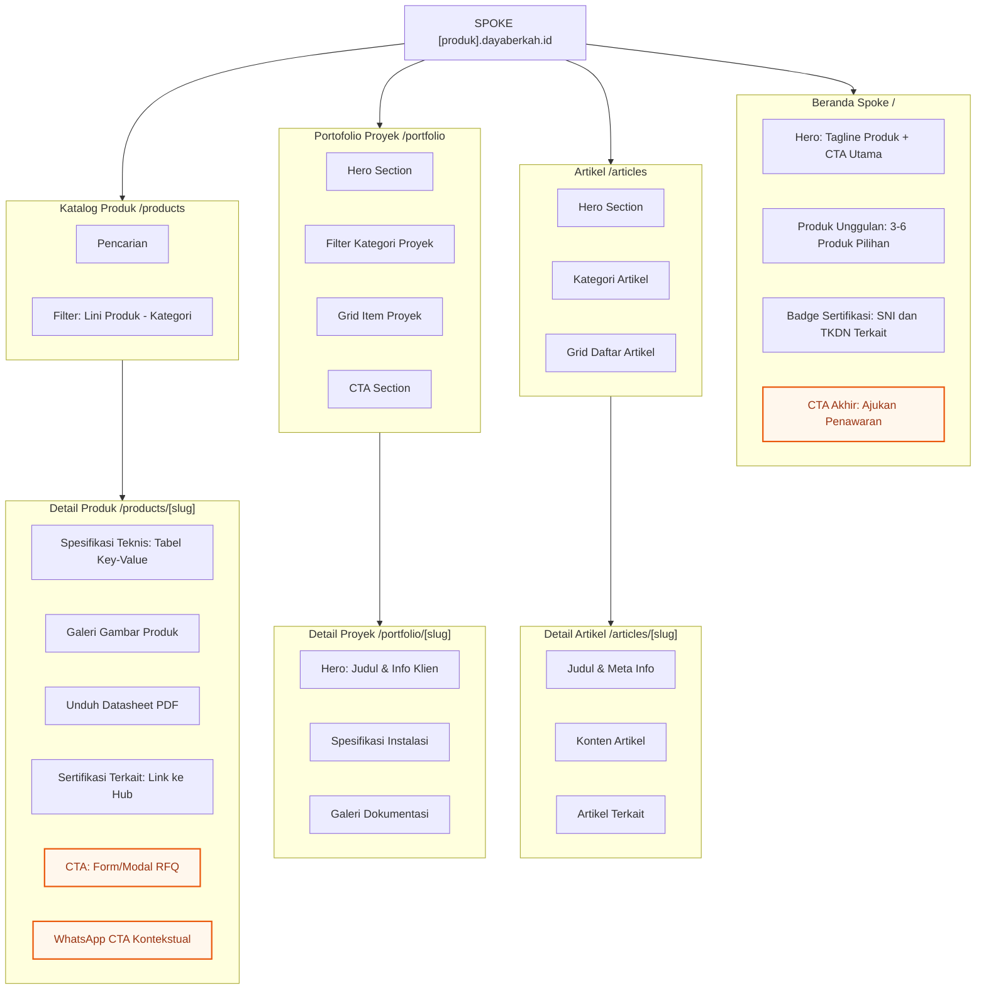
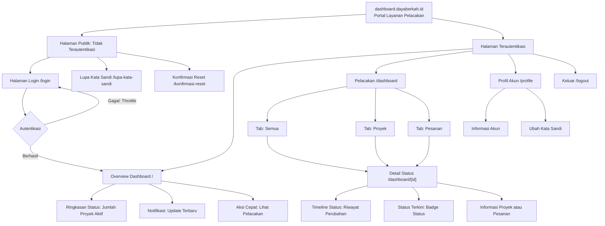

# Arsitektur Informasi — DBSN Digital Ecosystem
## Bagian 2: Sitemap Hub, Spoke, & Dashboard

**Proyek:** DBSN Centralized Digital Ecosystem — dayaberkah.id  
**Berbasis:** PRD v3.1  
**Tanggal Update:** 2026-08-06  

---

## 3. Sitemap Hub (dayaberkah.id)

Hub berfungsi sebagai **Pusat Kepercayaan Korporat** — tempat utama untuk validasi legalitas, portofolio, dan routing ke spoke produk.



### Penjelasan Struktur Hub

| Halaman | Tujuan | Target Segmen |
|---------|--------|---------------|
| **Beranda** | Routing utama + sinyal kepercayaan awal | Semua |
| **Tentang Kami** (`/about`) | Profil korporat, visi misi, tim — membangun kredibilitas | B2G (primer) |
| **Pusat Sertifikasi** (`/certifications`) | Akses matriks sertifikasi berdasarkan tipe (SNI/TKDN/LKPP/ISO) | B2G (kritis) |
| **Portofolio Proyek** (`/portfolio`) | Referensi proyek terstruktur dengan filter sektor | B2G + B2B |
| **Produk Kami** (`/products`) | Showcase produk & mega menu routing ke spoke sub-domain | Semua |
| **Hubungi Kami & RFQ** (`/contact`) | Kontak, lokasi, serta Formulir RFQ tersegmentasi (B2G/B2B) | Semua (konversi) |
| **Artikel** (`/articles`) | Konten edukasi dan informasi produk untuk penemuan organik | Semua |
| **Detail Artikel** (`/articles/[slug]`) | Artikel lengkap dengan konten dan referensi terkait | Semua |

---

## 4. Sitemap Spoke Representatif ([produk].dayaberkah.id)

Template spoke ini berlaku untuk **semua klaster produk** (PJU, Panel Surya, Penangkal Petir, Baterai, dan spoke masa depan). Contoh menggunakan PJU.

### 4.1 Hirarki Halaman Spoke



### 4.2 Struktur URL Spoke

```
[spoke].dayaberkah.id/
├── /                                          → Beranda Spoke
├── /products                                  → Katalog & Listing Produk Spoke
│   └── /products/[slug]                       → Detail Produk (PDP)
├── /portfolio                                 → Daftar Portofolio Proyek Spoke
│   └── /portfolio/[slug]                      → Detail Proyek Spoke
├── /articles                                  → Daftar Artikel Spoke
│   └── /articles/[slug]                       → Detail Artikel Spoke
```

**Routing Single-App:** Struktur URL di atas di-handle oleh middleware Next.js 16 untuk menentukan subdomain yang diminta dan merender komponen yang sesuai secara data-driven dari Sanity CMS.

### 4.3 Komponen PDP (Product Detail Page)

PDP adalah halaman konversi kunci. Setiap PDP memiliki:

| Komponen | Deskripsi | Posisi |
|----------|-----------|--------|
| **Breadcrumb** | Beranda > Produk > Detail Produk | Atas |
| **Judul Produk** | H1 dengan nama produk | Atas |
| **Galeri Gambar** | Carousel gambar produk | Atas (kiri di desktop) |
| **Spesifikasi Teknis** | Tabel key-value dari Sanity | Atas (kanan di desktop) |
| **Deskripsi Lengkap** | Portable text dari CMS | Tengah |
| **Unduh Datasheet** | Tombol download PDF (GA4: file_download) | Tengah |
| **Sertifikasi Terkait** | Kartu link ke TKDN/SNI di Hub | Bawah |
| **CTA Penawaran** | Tombol primary → Modal/Form RFQ terintegrasi | Bawah (sticky mobile) |
| **WhatsApp CTA** | Floating button kontekstual | Fixed kanan bawah |

---

## 5. Sitemap Dashboard (dashboard.dayaberkah.id)

Dashboard adalah **surface operasional tertutup** untuk klien B2B/B2G yang telah terkualifikasi. Phase 1 mencakup pelacakan status. Pada Single-App Next.js 16, routing ke `dashboard.dayaberkah.id` di-handle oleh middleware yang mengidentifikasi hostname `dashboard` dan merender route group `dashboard`.

### 5.1 Struktur URL Dashboard

```
dashboard.dayaberkah.id/
├── /login                     → Halaman login (publik)
├── /lupa-kata-sandi           → Reset password (publik)
├── /konfirmasi-reset           → Konfirmasi reset (publik)
├── /                           → Overview dashboard (auth)
├── /dashboard                 → Daftar pelacakan + filter tab (auth)
│   └── /[id]                  → Detail status proyek/pesanan (auth, row-level)
├── /profile                   → Profil dan ubah kata sandi (auth)
└── /logout                    → Logout action
```



### 5.2 Status Pelacakan (Phase 1)

| Status | Deskripsi | Warna Badge |
|--------|-----------|-------------|
| **Diterima** | RFQ/pesanan diterima | Abu-abu |
| **Diproses** | Sedang diproses tim internal | Biru |
| **Produksi** | Dalam tahap produksi | Kuning |
| **Pengiriman** | Dalam pengiriman | Oranye |
| **Selesai** | Proyek/pesanan selesai | Hijau |
| **Ditunda** | Ditunda sementara | Merah |

---

> **Dokumen sebelumnya:** [Bagian 1 — Strategi & Navigasi](./ia-strategy-navigation.md)  
> **Dokumen selanjutnya:** [Bagian 3 — Alur Pengguna Inti](./ia-user-flows.md)
