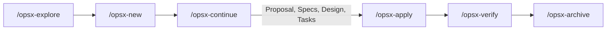

# OpenSpec Extended Workflow (OPSX) & ECC Discipline Guide

> **TL;DR**: Authoritative specification and architectural reference for OpenSpec Extended Workflow (OPSX) & ECC Discipline Guide within the DBSN platform (docs/engineering/governance/openspec-workflow.md).

> **Authoritative Baseline Reference**: Collaboration protocol for AI agent harnesses (Antigravity CLI / `agy`) and human engineers using the **OpenSpec Extended Workflow (OPSX)** and **Every Code Change (ECC)** discipline, fully aligned with PRD v4.0.0 ([`prd.md`](file:///d:/dev/arostech-hub/docs/strategy/prd/00-overview-and-goals.md#L1-L100)).

---

## 1. Operating Principles

1. **Context Alignment**: AI agents MUST inspect codebase state, read context specifications from `openspec/config.yaml`, and enforce governance rules before proposing code changes.
2. **Plan -> TDD -> Review Sequence**: For all non-trivial modifications, agents SHALL scaffold OpenSpec changes before writing application code.
3. **Documentation Mode Guardrail**: When `[DOCS_MODE]` is active, codebase files (`src/`, `prisma/`, `package.json`) MUST remain strictly read-only.

---

## 2. OpenSpec Change Lifecycle

### Artifact Sequence

1. `proposal.md`: Defines motivation ("Why"), scope ("What Changes"), and impact assessment.
2. `specs/<capability-path>/spec.md`: Formal BDD contracts and testable scenarios using GIVEN/WHEN/THEN.
3. `design.md`: Technical architecture decisions and migration plan.
4. `tasks.md`: Task breakdown checklist (`- [ ]`).

---

## 3. Command Reference

- `/opsx-explore`: Investigative read-only research and design tree clarification.
- `/opsx-new <change-name>`: Scaffold a new change directory under `openspec/changes/`.
- `/opsx-continue`: Progressively generate required planning artifacts.
- `/opsx-apply`: Implement code changes task-by-task under TDD.
- `/opsx-archive`: Merge delta specs into baseline specs and archive completed change within 24 hours.

---

## 4. OpenSpec Behavioral Requirements

### Requirement: REQ-ENG-OPENSPEC-001-LIFECYCLE
Every application code modification outside `docs/` SHALL have a corresponding approved OpenSpec change artifact under `openspec/changes/`.

#### Scenario: Code Modification Verification
- GIVEN an engineer or AI agent attempting to modify production code in `src/`
- WHEN initiating the change
- THEN an OpenSpec proposal, specification, and task checklist MUST exist and be approved prior to implementation.

---

## 5. OpenSpec Delta

## ADDED Requirements
- REQ-ENG-OPENSPEC-001-LIFECYCLE: Mandatory spec-driven change artifact requirement.

## MODIFIED Requirements
- Standardized command reference and lifecycle mapping.

## REMOVED Requirements
- Unstructured direct code edits.

---

## 6. Graphify Knowledge Graph Anchoring

- Knowledge Graph Node ID: `doc:docs/engineering/governance/openspec-workflow.md`
- Graphify Community: `community_governance`
- Master Governance: [`ai-agent-rules.md`](file:///d:/dev/arostech-hub/docs/engineering/governance/ai-agent-rules.md#L1-L60)
