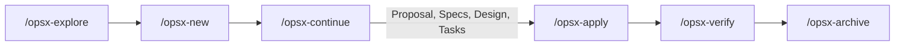

# ECC & OpenSpec Extended Workflow Integration Guide

This guide describes how AI agent assistants (Antigravity CLI / `agy`) collaborate with human developers using the **OpenSpec Extended Workflow (OPSX)** and **Every Code Change (ECC)** discipline within this repository.

---

## 1. Core Operating Principles

1. **Context Coordination**: AI agents inspect codebase state, read context specifications from `openspec/config.yaml`, and enforce project rules before proposing changes.
2. **Plan -> TDD -> Review Cycle**: For non-trivial modifications, agents must scaffold OpenSpec changes before writing application code.
3. **Documentation Mode Guardrails**: When documentation mode (`[DOCS_MODE]`) is active, code files (`src/`, `prisma/`, `package.json`) are **STRICTLY READ-ONLY**.

---

## 2. OpenSpec Change Lifecycle

### Artifact Sequence

1. `proposal.md`: Outlines motivation ("Why"), scope ("What Changes"), capability paths, and impact.
2. `specs/<capability-path>/spec.md`: Formal behavioral contracts and testable scenarios using WHEN/THEN syntax.
3. `design.md`: Technical decisions, architecture trade-offs, and migration plan.
4. `tasks.md`: Checkbox-driven task checklist (`- [ ]`).

---

## 3. Command Reference

- `/opsx-explore`: Investigative read-only research and design tree clarification.
- `/opsx-new <change-name>`: Scaffold a new change directory under `openspec/changes/`.
- `/opsx-continue`: Progressively generate required planning artifacts.
- `/opsx-apply`: Implement code changes task-by-task.
- `/opsx-archive`: Merge delta specs and archive completed change.
