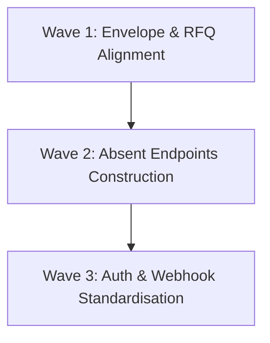

# Card 1.4 API Routes Audit Findings Report

> **TL;DR**: Authoritative specification and architectural reference for Card 1.4 API Routes Audit Findings Report within the DBSN platform (docs/operations/audits/phase-1-findings/api-findings.md).


> **Audit Date**: 2026-08-13  
> **Target Repository**: `d:/dev/arostech-hub`  
> **Branch**: `refactor/reorganize-project-documentation`  
> **Scope**: `src/app/api/` (all `route.ts` files recursively)  
> **Benchmark Reference**: [`docs/system/api/reference.md`](file:///d:/dev/arostech-hub/docs/system/api/reference.md#L1-L306)

---

## 1. Executive Summary

This audit performs a full static analysis and contract verification of all API route handlers (`route.ts`) in `src/app/api/` against the authoritative API specifications documented in [`reference.md`](file:///d:/dev/arostech-hub/docs/system/api/reference.md#L1-L306).

### Key Audit Conclusions
1. **Total Endpoint Inventory**: 9 `route.ts` files containing **13 HTTP method handlers** were identified across `src/app/api/`. All route handlers explicitly set `export const runtime = 'edge'` (or `force-dynamic`).
2. **Standard Response Envelope Drift**: **100% of custom API handlers** violate the mandated `{success, data, error, meta}` response envelope defined in [`reference.md`](file:///d:/dev/arostech-hub/docs/system/api/reference.md#L21-L57). Instead, handlers emit ad-hoc objects such as `{success, redirects}`, `{success, message}`, `{revalidated, now, documentId}`, or `{data}` / `{error}` without top-level `success`, `error: null`, or `meta` fields.
3. **RFQ Zod Schema & Payload Mismatch**:
   - `reference.md` mandates a composite, nested `rfqSubmissionSchema` (`contact`, `meta`, `items`) with `camelCase` fields and strictly forbids top-level `segment` discriminators.
   - Production code (`src/app/api/rfq/route.ts` and `src/lib/schema/rfq-schemas.ts`) implements flat `rfqB2BSchema` / `rfqB2GSchema` requiring a top-level `segment` discriminator (`B2B` | `B2G`) and `snake_case` keys (`contact_name`, `contact_email`, `source_domain`, `product_id`, etc.).
4. **Absent Endpoints Confirmed**: Three critical admin and tracking endpoints specified in the PRD architecture are completely absent from `src/app/api/`:
   - `GET /api/admin/leads` (**ABSENT**)
   - `PATCH /api/admin/leads/:id/status` (**ABSENT**)
   - `GET /api/dashboard/tracking` (**ABSENT**)

---

## 2. Complete Endpoint Inventory Matrix

The table below catalogs every `route.ts` handler discovered in `src/app/api/`:

| Path Anchor | HTTP Method | Auth / Middleware Guard | Edge Runtime | Response Envelope Compliant | Description / Status |
| :--- | :--- | :--- | :--- | :--- | :--- |
| [`src/app/api/admin/redirects/route.ts`](file:///d:/dev/arostech-hub/src/app/api/admin/redirects/route.ts#L16) | `GET` | `requireAuth('ADMIN')` | `edge` | ❌ No (`{success, redirects}`) | List all redirect map entries |
| [`src/app/api/admin/redirects/route.ts`](file:///d:/dev/arostech-hub/src/app/api/admin/redirects/route.ts#L37) | `POST` | `requireAuth('ADMIN')` | `edge` | ❌ No (`{success, redirect}`) | Create or update redirect map entry |
| [`src/app/api/admin/redirects/route.ts`](file:///d:/dev/arostech-hub/src/app/api/admin/redirects/route.ts#L92) | `DELETE` | `requireAuth('ADMIN')` | `edge` | ❌ No (`{success, message}`) | Delete redirect map entry |
| [`src/app/api/an-token/route.ts`](file:///d:/dev/arostech-hub/src/app/api/an-token/route.ts#L23) | `POST` | `auth()` (Active Session) | `edge` | ❌ No (Raw 21st SDK token / `{success, error}`) | Issue 21st SDK session token |
| [`src/app/api/auth/forgot-password/route.ts`](file:///d:/dev/arostech-hub/src/app/api/auth/forgot-password/route.ts#L14) | `POST` | Public + Rate Limiter | `edge` | ❌ No (`{success, message}`) | Generate password reset token & dispatch email |
| [`src/app/api/auth/reset-password/route.ts`](file:///d:/dev/arostech-hub/src/app/api/auth/reset-password/route.ts#L7) | `POST` | Public (Token Verification) | `edge` | ❌ No (`{success, message}`) | Reset user password via verification token |
| [`src/app/api/auth/[...nextauth]/route.ts`](file:///d:/dev/arostech-hub/src/app/api/auth/[...nextauth]/route.ts#L2) | `GET` | Auth.js Handler | `edge` | ℹ️ Auth.js Native | Catch-all Auth.js session / callback handler |
| [`src/app/api/auth/[...nextauth]/route.ts`](file:///d:/dev/arostech-hub/src/app/api/auth/[...nextauth]/route.ts#L2) | `POST` | Auth.js Handler | `edge` | ℹ️ Auth.js Native | Catch-all Auth.js credentials / signout handler |
| [`src/app/api/cron/notifications/route.ts`](file:///d:/dev/arostech-hub/src/app/api/cron/notifications/route.ts#L8) | `GET` | `CRON_SECRET` Header | `edge` | ❌ No (`{success, message}`) | Process pending background notification queue |
| [`src/app/api/redirects/lookup/route.ts`](file:///d:/dev/arostech-hub/src/app/api/redirects/lookup/route.ts#L5) | `GET` | Public | `edge` | ❌ No (`{success, targetUrl}`) | Edge middleware redirect map lookup |
| [`src/app/api/revalidate/route.ts`](file:///d:/dev/arostech-hub/src/app/api/revalidate/route.ts#L192) | `GET` | Public | `edge` | ❌ No (`{status, webhookConfigured}`) | Webhook configuration health check |
| [`src/app/api/revalidate/route.ts`](file:///d:/dev/arostech-hub/src/app/api/revalidate/route.ts#L75) | `POST` | Sanity HMAC Signature | `edge` | ❌ No (`{revalidated, now, documentId, tags}`) | Sanity ISR tag revalidation webhook |
| [`src/app/api/rfq/route.ts`](file:///d:/dev/arostech-hub/src/app/api/rfq/route.ts#L195) | `GET` | Public | `edge` | ❌ No (`{status, api, version}`) | RFQ ingestion health check |
| [`src/app/api/rfq/route.ts`](file:///d:/dev/arostech-hub/src/app/api/rfq/route.ts#L26) | `POST` | Public + Rate Limiter | `edge` | ❌ No (`{data}` or `{error}` without full envelope) | RFQ lead submission endpoint |

---

## 3. Detailed Schema Verification & Contract Diffs

### 3.1 RFQ Engine (`/api/rfq`) Schema & Payload Comparison

#### Specification Contract ([`reference.md#L68-L114`](file:///d:/dev/arostech-hub/docs/system/api/reference.md#L68-L114))
The specification mandates a composite `rfqSubmissionSchema`:
- **Structure**: Nested objects (`contact`, `meta`, `items`).
- **Naming Convention**: `camelCase` throughout.
- **Discriminator Rule**: Explicitly forbids top-level `segment` discriminators or `z.discriminatedUnion` branches.
- **Fields**:
  - `contact`: `fullName`, `email`, `phone`, `companyName`
  - `meta`: `sourceDomain`, `sourcePagePath`, `procurementType`, `utmSource`, `utmMedium`, `utmCampaign`, `utmTerm`, `utmContent`
  - `items`: `spokeSegment` (`"pju"` \| `"solarcell"` \| `"alatpetir"` \| `"baterai"`), `productCategory`, `quantity`, `unitOfMeasure`, `unitPriceEstimate`, `projectScope`, `timeline`, `notes`

#### Code Implementation ([`src/lib/schema/rfq-schemas.ts`](file:///d:/dev/arostech-hub/src/lib/schema/rfq-schemas.ts#L148-L166) & [`src/app/api/rfq/route.ts`](file:///d:/dev/arostech-hub/src/app/api/rfq/route.ts#L62-L76))
- **Structure**: Flat merged schemas (`rfqB2BSchema`, `rfqB2GSchema`).
- **Naming Convention**: `snake_case` (`contact_name`, `contact_email`, `contact_phone`, `company_name`, `source_domain`, `source_page_path`, `product_id`, `product_name`, `item_notes`, `dipa_reference`, `procurement_type`).
- **Discriminator**: Mandatory top-level `segment` discriminator (`"B2B"` \| `"B2G"`).
- **Composite Schema**: `rfqSubmissionSchema` **does not exist** in `src/lib/schema/rfq-schemas.ts`.

#### Contract Diff Table (`POST /api/rfq`)

| Domain Aspect | Spec Contract (`reference.md`) | Code Implementation (`rfq-schemas.ts`) | Severity |
| :--- | :--- | :--- | :--- |
| **Schema Name** | `rfqSubmissionSchema` | `rfqB2BSchema` / `rfqB2GSchema` | **CRITICAL** |
| **Discriminator** | Forbidden | Top-level `segment: "B2B" \| "B2G"` mandatory | **CRITICAL** |
| **Key Casing** | `camelCase` (`fullName`, `sourceDomain`) | `snake_case` (`contact_name`, `source_domain`) | **HIGH** |
| **Cart Items Model**| `spokeSegment`, `productCategory`, `unitOfMeasure`, `unitPriceEstimate` | `product_id`, `product_name`, `quantity`, `variant`, `item_notes` | **HIGH** |
| **Procurement Type**| Placed in `meta.procurementType` | Placed at root level `procurement_type` (B2G only) | **MEDIUM** |
| **201 Response Data**| `{ id, submissionStatus, dashboardAccessStatus, itemCount, createdAt }` | `{ id, submission_status, dashboard_access_status, created_at }` | **HIGH** |

---

## 4. Response Envelope Compliance Audit

Section 1 of [`reference.md`](file:///d:/dev/arostech-hub/docs/system/api/reference.md#L21-L57) specifies that **all** endpoints MUST return:

```typescript
export interface ApiResponse<T = unknown> {
  success: boolean;
  data: T | null;
  error: ApiError | null;
  meta: ApiMeta | null;
}
```

### Route-by-Route Breakdown

1. **`POST /api/rfq`**:
   - *201 Created*: Returns `{ data: { id, submission_status, ... } }`. **Missing `success: true`, `error: null`, and `meta`**.
   - *400 / 422 / 429 / 503 Errors*: Returns `{ error: { code, message, details } }`. **Missing `success: false`, `data: null`, and `meta`**.
2. **`GET/POST/DELETE /api/admin/redirects`**:
   - Returns `{ success: true, redirects }`, `{ success: true, redirect }`, or `{ success: true, message }`. **Data is not wrapped under `data`, `error` and `meta` are omitted**.
3. **`POST /api/auth/forgot-password` & `POST /api/auth/reset-password`**:
   - Returns `{ success: true, message }` or `{ success: false, error }`. **Data is returned as a top-level `message` string instead of `data: { message }` and `meta` is omitted**.
4. **`GET /api/cron/notifications`**:
   - Returns `{ success: true, message }` or `{ success: false, error }`. **Violates four-key envelope**.
5. **`GET /api/redirects/lookup`**:
   - Returns `{ success: true, targetUrl: string | null }`. **Missing `data` wrapper, `error: null`, and `meta`**.
6. **`POST /api/revalidate`**:
   - Returns `{ revalidated: true, now: number, documentId: string, tags: string[] }`. **Missing top-level `success`, `data`, `error`, and `meta`**.
7. **`POST /api/an-token`**:
   - Returns 21st SDK response payload or `{ success: false, error: string }`. **Violates standard envelope**.

---

## 5. Absent Endpoints Verification

The following three endpoints are explicitly documented in system requirements and PRD specs, but were **verified ABSENT** from `src/app/api/`:

### 5.1 `GET /api/admin/leads`
- **Expected Path**: `src/app/api/admin/leads/route.ts`
- **Status**: ❌ **ABSENT**
- **Impact**: Admin dashboard cannot list or filter incoming RFQ submissions stored in the Neon Postgres `leads` table.

### 5.2 `PATCH /api/admin/leads/:id/status`
- **Expected Path**: `src/app/api/admin/leads/[id]/status/route.ts`
- **Status**: ❌ **ABSENT**
- **Impact**: Internal sales administrators cannot update lead statuses (`RECEIVED` -> `QUALIFIED` -> `PROPOSAL_SENT` -> `CLOSED_WON`).

### 5.3 `GET /api/dashboard/tracking`
- **Expected Path**: `src/app/api/dashboard/tracking/route.ts`
- **Status**: ❌ **ABSENT**
- **Impact**: Client portal users cannot fetch project tracking milestones restricted by `user.trackingScopeIds`.

---

## 6. Recommended Wave Remediation Plan

To bring `src/app/api/` into 100% compliance with [`reference.md`](file:///d:/dev/arostech-hub/docs/system/api/reference.md#L1-L306) and PRD v4.0.0, remediation should be executed in three phased waves:



### Wave 1: Core Envelope Standardisation & RFQ Schema Alignment
- **Priority**: HIGH (Impacts public API consumers & validation contracts)
- **Tasks**:
  1. Create helper utility `src/lib/api/response.ts` implementing `createApiResponse<T>(data, error, meta, status)`.
  2. Refactor `src/lib/schema/rfq-schemas.ts` to export `rfqSubmissionSchema` matching `reference.md` (`contact`, `meta`, `items` in `camelCase`).
  3. Refactor `src/app/api/rfq/route.ts` to use `rfqSubmissionSchema` and wrap all 201, 400, 422, 429, and 503 responses in the standardized `{success, data, error, meta}` envelope.
  4. Update `src/app/api/rfq/__tests__/route.test.ts` to assert against the aligned envelope and schema structure.

### Wave 2: Absent Endpoints Construction
- **Priority**: HIGH (Required for Admin CRM and Client Portal functionality)
- **Tasks**:
  1. Author `src/app/api/admin/leads/route.ts` (`GET`) with pagination and status filtering using Prisma ORM.
  2. Author `src/app/api/admin/leads/[id]/status/route.ts` (`PATCH`) with Zod status validation.
  3. Author `src/app/api/dashboard/tracking/route.ts` (`GET`) enforcing `trackingScopeIds` scoping.

### Wave 3: Redirects, Auth & Webhook Envelope Unification
- **Priority**: MEDIUM
- **Tasks**:
  1. Refactor `src/app/api/admin/redirects/route.ts` (`GET`, `POST`, `DELETE`) to return standard `{success, data, error, meta}` envelopes.
  2. Refactor `src/app/api/auth/forgot-password/route.ts` and `reset-password/route.ts` to return standard envelopes.
  3. Refactor `src/app/api/revalidate/route.ts` (`GET`, `POST`) and `src/app/api/redirects/lookup/route.ts` (`GET`) to return standard envelopes.
  4. Update unit test `src/app/api/revalidate/__tests__route.test.ts`.

---

## 7. Knowledge Graph Anchoring & Verification

- **Knowledge Graph Node**: `doc:docs/operations/audits/phase-1-findings/api-findings.md`
- **Graphify Community**: `community_api`
- **Related Spec Anchor**: [`reference.md`](file:///d:/dev/arostech-hub/docs/system/api/reference.md#L1-L306)
- **Related Code Anchors**:
  - [`src/app/api/rfq/route.ts`](file:///d:/dev/arostech-hub/src/app/api/rfq/route.ts#L1-L202)
  - [`src/lib/schema/rfq-schemas.ts`](file:///d:/dev/arostech-hub/src/lib/schema/rfq-schemas.ts#L1-L183)
