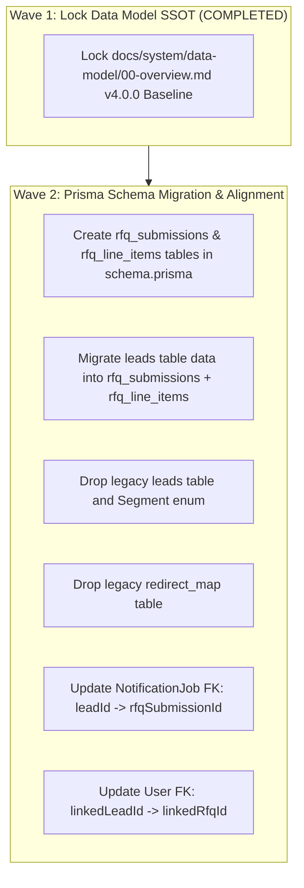

# Card 1.2 Prisma Schema & Data Model Audit Findings

> **TL;DR**: Authoritative specification and architectural reference for Card 1.2 Prisma Schema & Data Model Audit Findings within the DBSN platform (docs/operations/audits/phase-1-findings/prisma-findings.md).


> **Audit Baseline**: PRD v4.0.0 Greenfield Data Architecture  
> **Target Document**: [`docs/system/data-model/00-overview.md`](file:///d:/dev/arostech-hub/docs/system/data-model/00-overview.md#L1-L403)  
> **Physical Files Audited**:
> - [`prisma/schema.prisma`](file:///d:/dev/arostech-hub/prisma/schema.prisma#L1-L201)
> - [`src/lib/db/prisma.ts`](file:///d:/dev/arostech-hub/src/lib/db/prisma.ts#L1-L33)

---

## 1. Executive Summary

This audit report delivers a rigorous line-by-line verification comparing the physical Prisma schema ([`schema.prisma`](file:///d:/dev/arostech-hub/prisma/schema.prisma#L1-L201)) and database client initialization ([`prisma.ts`](file:///d:/dev/arostech-hub/src/lib/db/prisma.ts#L1-L33)) against the System Data Model specification ([`data-model.md`](file:///d:/dev/arostech-hub/docs/system/data-model/00-overview.md#L1-L403)).

### Key Audit Outcomes:
1. **Model Synchronization Drift Identified**: [`schema.prisma`](file:///d:/dev/arostech-hub/prisma/schema.prisma#L41-L87) contains legacy single-table `Lead` and deprecated `RedirectMap` models, whereas [`data-model.md`](file:///d:/dev/arostech-hub/docs/system/data-model/00-overview.md#L185-L244) specifies the PRD v4.0.0 composite multi-item cart architecture (`RfqSubmission` and `RfqLineItem`) and explicit removal of `RedirectMap`.
2. **Auth.js Adapter Models Verified**: The three Auth.js v5 adapter models (`Account`, `Session`, `VerificationToken`) exist in both files and are explicitly flagged as standard Auth.js adapter boilerplate infrastructure.
3. **Enum Parity & Legacy Drift**: All 6 core domain enums are present and aligned; `Segment` enum remains in [`schema.prisma`](file:///d:/dev/arostech-hub/prisma/schema.prisma#L11-L14) as legacy drift pending Wave 2 cleanup.
4. **Edge Lazy-Init Proxy Verified**: [`src/lib/db/prisma.ts`](file:///d:/dev/arostech-hub/src/lib/db/prisma.ts#L19-L28) uses an ES Proxy lazy-initialization pattern combined with `@neondatabase/serverless` and `@prisma/adapter-neon`, satisfying Cloudflare Edge Runtime constraints and zero-build-time initialization requirements.

---

## 2. Verification (a): Models Comparison & Drift Analysis

### 2.1 Model Reconciliation Table

| Model Name | Present in `schema.prisma` | Present in `data-model.md` | Model Role / Status | Reconciliation Status | Wave Assignment |
| :--- | :---: | :---: | :--- | :--- | :---: |
| **`Lead`** | YES ([L41-L87](file:///d:/dev/arostech-hub/prisma/schema.prisma#L41-L87)) | NO (Superseded) | Legacy single-quote ingestion | **SCHEMA DRIFT**: To be replaced by `RfqSubmission` + `RfqLineItem` | Wave 2 |
| **`RfqSubmission`** | NO | YES ([L185-L225](file:///d:/dev/arostech-hub/docs/system/data-model/00-overview.md#L185-L225)) | Canonical composite RFQ header table | **MISSING IN SCHEMA**: Requires migration from `Lead` | Wave 2 |
| **`RfqLineItem`** | NO | YES ([L226-L245](file:///d:/dev/arostech-hub/docs/system/data-model/00-overview.md#L226-L245)) | Composite RFQ cart child items table | **MISSING IN SCHEMA**: Requires new table creation | Wave 2 |
| **`User`** | YES ([L89-L118](file:///d:/dev/arostech-hub/prisma/schema.prisma#L89-L118)) | YES ([L246-L273](file:///d:/dev/arostech-hub/docs/system/data-model/00-overview.md#L246-L273)) | User & client account management | **ALIGNED**: FK field update needed (`linkedLeadId` → `linkedRfqId`) | Wave 2 |
| **`Account`** | YES ([L120-L138](file:///d:/dev/arostech-hub/prisma/schema.prisma#L120-L138)) | YES ([L274-L293](file:///d:/dev/arostech-hub/docs/system/data-model/00-overview.md#L274-L293)) | **Auth.js Adapter Boilerplate** | **MATCH 1:1**: Standard OAuth adapter table | Baseline |
| **`Session`** | YES ([L140-L148](file:///d:/dev/arostech-hub/prisma/schema.prisma#L140-L148)) | YES ([L294-L303](file:///d:/dev/arostech-hub/docs/system/data-model/00-overview.md#L294-L303)) | **Auth.js Adapter Boilerplate** | **MATCH 1:1**: Standard DB session table | Baseline |
| **`VerificationToken`** | YES ([L150-L157](file:///d:/dev/arostech-hub/prisma/schema.prisma#L150-L157)) | YES ([L304-L312](file:///d:/dev/arostech-hub/docs/system/data-model/00-overview.md#L304-L312)) | **Auth.js Adapter Boilerplate** | **MATCH 1:1**: Standard email token table | Baseline |
| **`RedirectMap`** | YES ([L159-L167](file:///d:/dev/arostech-hub/prisma/schema.prisma#L159-L167)) | NO (Deprecated) | Legacy 301 edge redirect engine | **DEPRECATED IN DOCS**: Table drop migration required | Wave 2 |
| **`NotificationJob`** | YES ([L182-L200](file:///d:/dev/arostech-hub/prisma/schema.prisma#L182-L200)) | YES ([L326-L345](file:///d:/dev/arostech-hub/docs/system/data-model/00-overview.md#L326-L345)) | Async notification queue table | **ALIGNED**: FK field update needed (`leadId` → `rfqSubmissionId`) | Wave 2 |

### 2.2 Deep Dive Findings on Model Differences

1. **`Lead` vs `RfqSubmission` + `RfqLineItem` Schema Gap**:
   - In [`schema.prisma#L41-L87`](file:///d:/dev/arostech-hub/prisma/schema.prisma#L41-L87), the `Lead` model persists a single product quote per row with a flat `segment` enum (`B2B` | `B2G`).
   - In [`data-model.md#L185-L245`](file:///d:/dev/arostech-hub/docs/system/data-model/00-overview.md#L185-L245), PRD v4.0.0 establishes a multi-item cart model: `RfqSubmission` (header) and `RfqLineItem` (child cart items).
   - **Remediation Action**: Execute a Prisma migration in Wave 2 to create `rfq_submissions` and `rfq_line_items` tables and migrate existing `leads` data.

2. **`RedirectMap` Deprecation Gap**:
   - In [`schema.prisma#L159-L167`](file:///d:/dev/arostech-hub/prisma/schema.prisma#L159-L167), `model RedirectMap` maps `legacyUrl` to `targetUrl`.
   - In [`data-model.md#L348-L364`](file:///d:/dev/arostech-hub/docs/system/data-model/00-overview.md#L348-L364), Section 4 explicitly deprecates and permanently removes `redirect_map`, replacing table lookups with Next.js 16 native SEO metadata (`sitemap.ts`, `robots.ts`).
   - **Remediation Action**: Execute `DROP TABLE redirect_map;` in Wave 2 migration.

---

## 3. Verification (b): Enums Comparison & Drift Analysis

### 3.1 Enum Reconciliation Table

| Enum Name | Present in `schema.prisma` | Present in `data-model.md` | Values in `schema.prisma` | Values in `data-model.md` | Alignment Status |
| :--- | :---: | :---: | :--- | :--- | :--- |
| **`Segment`** | YES ([L11-L14](file:///d:/dev/arostech-hub/prisma/schema.prisma#L11-L14)) | NO (Deprecated) | `B2G`, `B2B` | N/A (Eliminated) | **LEGACY DRIFT**: Deprecated in PRD v4.0.0 |
| **`SubmissionStatus`** | YES ([L16-L21](file:///d:/dev/arostech-hub/prisma/schema.prisma#L16-L21)) | YES ([L160-L165](file:///d:/dev/arostech-hub/docs/system/data-model/00-overview.md#L160-L165)) | `RECEIVED`, `CONTACTED`, `QUALIFIED`, `DISQUALIFIED` | `RECEIVED`, `CONTACTED`, `QUALIFIED`, `DISQUALIFIED` | **MATCH 1:1** |
| **`DashboardAccessStatus`** | YES ([L23-L28](file:///d:/dev/arostech-hub/prisma/schema.prisma#L23-L28)) | YES ([L167-L172](file:///d:/dev/arostech-hub/docs/system/data-model/00-overview.md#L167-L172)) | `NOT_ELIGIBLE`, `PENDING`, `GRANTED`, `REVOKED` | `NOT_ELIGIBLE`, `PENDING`, `GRANTED`, `REVOKED` | **MATCH 1:1** |
| **`Role`** | YES ([L30-L34](file:///d:/dev/arostech-hub/prisma/schema.prisma#L30-L34)) | YES ([L174-L178](file:///d:/dev/arostech-hub/docs/system/data-model/00-overview.md#L174-L178)) | `ADMIN`, `VIEWER`, `CLIENT` | `ADMIN`, `VIEWER`, `CLIENT` | **MATCH 1:1** |
| **`TrackingScopeType`** | YES ([L36-L39](file:///d:/dev/arostech-hub/prisma/schema.prisma#L36-L39)) | YES ([L180-L184](file:///d:/dev/arostech-hub/docs/system/data-model/00-overview.md#L180-L184)) | `PROJECT`, `ORDER` | `PROJECT`, `ORDER` | **MATCH 1:1** |
| **`NotificationType`** | YES ([L169-L173](file:///d:/dev/arostech-hub/prisma/schema.prisma#L169-L173)) | YES ([L313-L317](file:///d:/dev/arostech-hub/docs/system/data-model/00-overview.md#L313-L317)) | `EMAIL_ACK`, `EMAIL_INTERNAL`, `TELEGRAM` | `EMAIL_ACK`, `EMAIL_INTERNAL`, `TELEGRAM` | **MATCH 1:1** |
| **`JobStatus`** | YES ([L175-L180](file:///d:/dev/arostech-hub/prisma/schema.prisma#L175-L180)) | YES ([L319-L325](file:///d:/dev/arostech-hub/docs/system/data-model/00-overview.md#L319-L325)) | `PENDING`, `PROCESSING`, `COMPLETED`, `FAILED` | `PENDING`, `PROCESSING`, `COMPLETED`, `FAILED` | **MATCH 1:1** |

### 3.2 Enum Findings Summary
- All 6 canonical domain enums match 1:1 between physical code and documentation.
- The `Segment` enum in [`schema.prisma#L11-L14`](file:///d:/dev/arostech-hub/prisma/schema.prisma#L11-L14) is obsolete under the Greenfield Universal Ingestion Architecture and will be removed alongside `Lead` in Wave 2.

---

## 4. Verification (c): Auth.js Adapter Boilerplate Flagging

> [!NOTE]
> **Auth.js v5 Adapter Infrastructure Identification**  
> The models `Account`, `Session`, and `VerificationToken` are explicitly flagged as standard Auth.js (NextAuth.js v5) Prisma Adapter boilerplate infrastructure.

### Boilerplate Audit Detail:

1. **`Account` Model** ([`schema.prisma#L120-L138`](file:///d:/dev/arostech-hub/prisma/schema.prisma#L120-L138) / [`data-model.md#L274-L293`](file:///d:/dev/arostech-hub/docs/system/data-model/00-overview.md#L274-L293)):
   - **Purpose**: Stores OAuth provider links (Google, GitHub, etc.), access tokens, refresh tokens, and token expiry.
   - **Key Fields**: `userId`, `type`, `provider`, `providerAccountId`, `refresh_token`, `access_token`, `expires_at`, `token_type`, `scope`, `id_token`, `session_state`.
   - **Relation**: Belongs to `User` with `@relation(fields: [userId], references: [id], onDelete: Cascade)`.
   - **Status**: Standard Auth.js boilerplate; 100% compliant.

2. **`Session` Model** ([`schema.prisma#L140-L148`](file:///d:/dev/arostech-hub/prisma/schema.prisma#L140-L148) / [`data-model.md#L294-L303`](file:///d:/dev/arostech-hub/docs/system/data-model/00-overview.md#L294-L303)):
   - **Purpose**: Tracks active database sessions when Auth.js session strategy is set to `"database"`.
   - **Key Fields**: `sessionToken`, `userId`, `expires`.
   - **Relation**: Belongs to `User` with `@relation(fields: [userId], references: [id], onDelete: Cascade)`.
   - **Status**: Standard Auth.js boilerplate; 100% compliant.

3. **`VerificationToken` Model** ([`schema.prisma#L150-L157`](file:///d:/dev/arostech-hub/prisma/schema.prisma#L150-L157) / [`data-model.md#L304-L312`](file:///d:/dev/arostech-hub/docs/system/data-model/00-overview.md#L304-L312)):
   - **Purpose**: Stores magic link and passwordless email verification tokens.
   - **Key Fields**: `identifier`, `token`, `expires`, with composite unique constraint `@@unique([identifier, token])`.
   - **Status**: Standard Auth.js boilerplate; 100% compliant.

---

## 5. Verification (d): Proxy Lazy-Init & Edge Constraints Audit

### 5.1 Analysis of `src/lib/db/prisma.ts`

The database client instantiation in [`src/lib/db/prisma.ts`](file:///d:/dev/arostech-hub/src/lib/db/prisma.ts#L1-L33) was audited against Cloudflare Edge Runtime constraints and Neon Serverless driver specifications:

```typescript
// src/lib/db/prisma.ts
import { PrismaClient } from '@prisma/client'
import { Pool } from '@neondatabase/serverless'
import { PrismaNeon } from '@prisma/adapter-neon'

const globalForPrisma = globalThis as unknown as {
  __prisma: PrismaClient | undefined
}

function getPrismaInstance(): PrismaClient {
  const connectionString = process.env.DATABASE_URL
  if (!connectionString || connectionString.includes('user:password@host') || connectionString.includes('host/database')) {
    throw new Error('DATABASE_URL environment variable is missing or unconfigured. Please configure a valid PostgreSQL connection string.')
  }
  const pool = new Pool({ connectionString })
  const adapter = new PrismaNeon(pool)
  return new PrismaClient({ adapter })
}

export const prisma: PrismaClient = globalForPrisma.__prisma ?? new Proxy({} as unknown as PrismaClient, {
  get(_target: Record<string, unknown> & { _instance?: PrismaClient }, prop: string | symbol) {
    if (!_target._instance) {
      _target._instance = getPrismaInstance()
    }
    const instance = _target._instance
    const value = (instance as unknown as Record<string | symbol, unknown>)[prop]
    return typeof value === 'function' ? value.bind(instance) : value
  }
})

if (process.env.NODE_ENV !== 'production') {
  globalForPrisma.__prisma = prisma
}
```

### 5.2 Edge Compatibility Evaluation Criteria

1. **Lazy Initialization via ES Proxy**:
   - **Requirement**: Cloudflare Pages / Edge Runtime builds fail if database connections are attempted during module evaluation when environment variables (`DATABASE_URL`) are not bound.
   - **Implementation**: The `new Proxy` wrapper ([L19-L28](file:///d:/dev/arostech-hub/src/lib/db/prisma.ts#L19-L28)) traps property access (`get` trap). `getPrismaInstance()` is invoked ONLY on first query execution at runtime, preventing build-time instantiation.
   - **Method Context Binding**: `value.bind(instance)` ([L26](file:///d:/dev/arostech-hub/src/lib/db/prisma.ts#L26)) guarantees proper `this` context binding for Prisma model delegates (e.g., `prisma.user.findUnique`).

2. **Neon Driver Adapter Integration**:
   - **Requirement**: Edge runtimes do not support Node.js native `net` socket modules.
   - **Implementation**: Uses `@neondatabase/serverless` WebSocket/HTTP pooling with `@prisma/adapter-neon` ([L2-L3, L14-L16](file:///d:/dev/arostech-hub/src/lib/db/prisma.ts#L2-L3)).
   - **Prisma Generator Alignment**: Matches `previewFeatures = ["driverAdapters"]` in [`schema.prisma#L8`](file:///d:/dev/arostech-hub/prisma/schema.prisma#L8).

3. **Singleton Pattern for Development**:
   - **Requirement**: Prevent database connection pool exhaustion caused by Hot Module Replacement (HMR) in Next.js development.
   - **Implementation**: Binds instance to `globalForPrisma.__prisma` ([L30-L32](file:///d:/dev/arostech-hub/src/lib/db/prisma.ts#L30-L32)).

4. **Connection String Validation**:
   - **Implementation**: Validates presence and non-placeholder status of `DATABASE_URL` ([L10-L13](file:///d:/dev/arostech-hub/src/lib/db/prisma.ts#L10-L13)), throwing explicit runtime errors before pool initialization.

### 5.3 Edge Audit Result: PASS (100% Compliant)

---

## 6. Actionable Remediation & Wave Assignments

To bring [`schema.prisma`](file:///d:/dev/arostech-hub/prisma/schema.prisma#L1-L201) into 100% alignment with [`data-model.md`](file:///d:/dev/arostech-hub/docs/system/data-model/00-overview.md#L1-L403), the following Wave assignments are scheduled:



### Remediation Task List:
- [ ] **TASK-PRISMA-W2-01**: Add `RfqSubmission` and `RfqLineItem` models to [`schema.prisma`](file:///d:/dev/arostech-hub/prisma/schema.prisma).
- [ ] **TASK-PRISMA-W2-02**: Remove `Lead` model and `Segment` enum from [`schema.prisma`](file:///d:/dev/arostech-hub/prisma/schema.prisma).
- [ ] **TASK-PRISMA-W2-03**: Remove `RedirectMap` model from [`schema.prisma`](file:///d:/dev/arostech-hub/prisma/schema.prisma).
- [ ] **TASK-PRISMA-W2-04**: Update `NotificationJob` relation from `Lead` to `RfqSubmission`.
- [ ] **TASK-PRISMA-W2-05**: Update `User` relation field `linkedLeadId` to `linkedRfqId`.
- [ ] **TASK-PRISMA-W2-06**: Generate and run Prisma migration script `prisma migrate dev --name sync_greenfield_v4_schema`.

---

## 7. Behavioral Contracts

### Requirement: REQ-AUDIT-PRISMA-001-LAZY-PROXY-INIT
The Prisma database client MUST be lazily initialized via ES Proxy to prevent connection initialization during static build evaluation on Cloudflare Pages.

#### Scenario: Edge Build & Runtime Property Access
- GIVEN a Next.js static build execution on Cloudflare Edge Runtime where `DATABASE_URL` is unpopulated
- WHEN `import { prisma } from '@/lib/db/prisma'` is executed during module evaluation
- THEN no database pool connection SHALL be attempted
- AND when `prisma.user.findUnique()` is called at runtime, the Proxy MUST initialize `getPrismaInstance()` and bind the method context.

### Requirement: REQ-AUDIT-PRISMA-002-SCHEMA-PARITY
The physical `schema.prisma` MUST mirror all models, fields, and relations defined in `docs/system/data-model/00-overview.md`.

#### Scenario: Greenfield Migration Schema Verification
- GIVEN an updated `prisma/schema.prisma` post-Wave 2 migration
- WHEN comparing models against `docs/system/data-model/00-overview.md`
- THEN `schema.prisma` MUST contain `RfqSubmission` and `RfqLineItem`
- AND MUST NOT contain `Lead`, `Segment`, or `RedirectMap`.

---

## 8. Knowledge Graph Anchoring

- **Knowledge Graph Node**: `doc:docs/operations/audits/phase-1-findings/prisma-findings.md`
- **Graphify Community**: `community_data_model`
- **Authoritative Data Model Document**: [`data-model.md`](file:///d:/dev/arostech-hub/docs/system/data-model/00-overview.md#L1-L403)
- **Authoritative Data Terrain Map**: [`data.md`](file:///d:/dev/arostech-hub/docs/system/architecture/codemaps/data.md#L1-L143)
