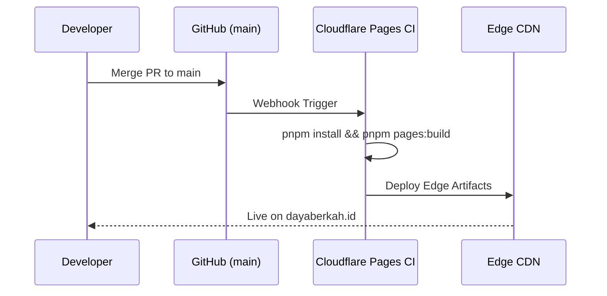

# Release Management & Cloudflare Deployment Pipeline

This document defines the Semantic Versioning (SemVer) policy, CI/CD pipeline, and Cloudflare Pages deployment workflows for the **DBSN Centralized Digital Ecosystem**.

---

## 1. Versioning Policy (SemVer)

We adhere to Semantic Versioning (`MAJOR.MINOR.PATCH`):

- **MAJOR (`v1.0.0` → `v2.0.0`)**: Breaking architectural changes (e.g. migrating routing engine or database provider).
- **MINOR (`v1.0.0` → `v1.1.0`)**: Adding a new product spoke, new major feature, or new public API endpoint.
- **PATCH (`v1.0.1`)**: Bug fixes, performance tweaks, security updates, or documentation updates.

---

## 2. Cloudflare Pages Deployment Workflow

### Automated Production Build (CI/CD)

Cloudflare Pages automatically triggers a production deployment whenever commits are merged into the `main` branch.



### Manual Deployment via CLI

If manual deployment is required from a verified local environment:

```bash
# 1. Compile Edge Bundle (@cloudflare/next-on-pages)
pnpm pages:build

# 2. Preview Edge Build locally via Wrangler
pnpm pages:preview

# 3. Deploy bundle to Cloudflare Pages production
pnpm pages:deploy
```

> **Windows Platform Note**: Running `pnpm pages:build` requires `bash` in your system `PATH` (available via Git Bash or WSL).

---

## 3. Pre-Release Launch Gate Checklist

Before promoting a build to production, verify:

- [ ] All unit and integration tests pass: `pnpm test`.
- [ ] Code coverage target met (80%+ threshold): `pnpm test:coverage`.
- [ ] ESLint checks clean: `pnpm lint`.
- [ ] Cloudflare secret bindings verified in Page Settings.
- [ ] Release release notes tagged in `CHANGELOG.md`.
