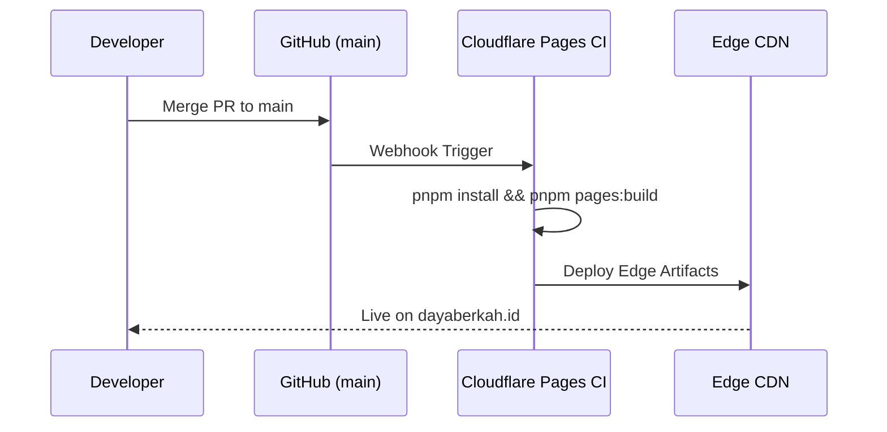

# Release Management & Cloudflare Deployment Pipeline Runbook

> **TL;DR**: Authoritative specification and architectural reference for Release Management & Cloudflare Deployment Pipeline Runbook within the DBSN platform (docs/operations/runbooks/release-process.md).


> **Authoritative Baseline Reference**: Deployment process, CI/CD pipeline, and Cloudflare Pages edge hosting release controls for the **DBSN Centralized Digital Ecosystem**, fully aligned with PRD v4.0.0 ([`prd.md`](file:///d:/dev/arostech-hub/docs/strategy/prd/00-overview-and-goals.md#L1-L100)) and [`0xrizz-workflow.md`](file:///d:/dev/arostech-hub/docs/engineering/governance/0xrizz-workflow.md#L1-L100).

---

## 1. Versioning Policy (SemVer 2.0.0)

All releases MUST follow Semantic Versioning (`MAJOR.MINOR.PATCH`):

- **MAJOR (`v3.0.0` → `v4.0.0`)**: Breaking architectural changes (e.g., domain topology redesign or database ORM shift).
- **MINOR (`v4.0.0` → `v4.1.0`)**: New product spoke capability, new public API endpoint, or schema addition.
- **PATCH (`v4.0.1`)**: Bug fixes, performance optimizations, security patches, or documentation updates.

---

## 2. Cloudflare Pages Deployment Workflow

### Automated Production Build (CI/CD)

Cloudflare Pages automatically triggers a production deployment whenever commits are merged into `main`.



### Manual Deployment Execution

If manual deployment is required from a verified local environment:

```bash
# 1. Compile Edge Bundle (@opennextjs/cloudflare)
pnpm pages:build

# 2. Preview Edge Build locally via Wrangler
pnpm pages:preview

# 3. Deploy bundle to Cloudflare Pages production
pnpm pages:deploy
```

---

## 3. Pre-Release Launch Gate Checklist

Before promoting a release candidate to production, operators MUST verify:

- [ ] All unit and integration tests pass: `pnpm test`.
- [ ] Total test coverage meets the **85.0%+** threshold (Strict Zero-Regression Gate): `pnpm test:coverage`.
- [ ] ESLint and static analysis pass clean: `pnpm lint`.
- [ ] Cloudflare encrypted secret bindings verified in Page Settings.
- [ ] Release notes tagged in `CHANGELOG.md`.

---

## 4. OpenSpec Behavioral Requirements

### Requirement: REQ-OPS-RELEASE-001-GATEWAY
Production deployments to Cloudflare Pages SHALL require 100% passing test suites, clean linting, and successful edge compilation.

#### Scenario: Production Deployment Trigger
- GIVEN a release candidate merged into `main`
- WHEN Cloudflare Pages executes the build script (`pnpm pages:build`)
- THEN the build pipeline SHALL generate edge artifacts and deploy to `dayaberkah.id` only if all pre-release checks pass.

---

## 5. OpenSpec Delta

## ADDED Requirements
- REQ-OPS-RELEASE-001-GATEWAY: Production release gateway gate.

## MODIFIED Requirements
- Aligned deployment target with Cloudflare Pages Edge Runtime.

## REMOVED Requirements
- Legacy Vercel deployment workflows.

---

## 6. Graphify Knowledge Graph Anchoring

- Knowledge Graph Node ID: `doc:docs/operations/runbooks/release-process.md`
- Graphify Community: `community_operations`
- Master Reference: [`versioning-policy.md`](file:///d:/dev/arostech-hub/docs/engineering/governance/versioning-policy.md#L1-L40)
