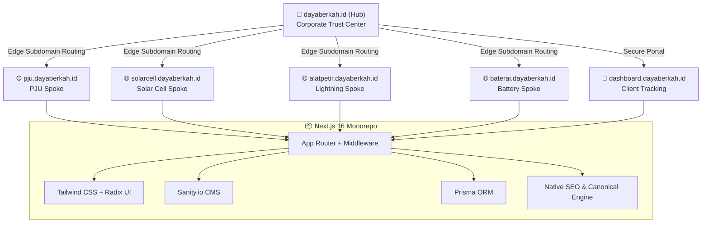

# PRD Module 00: Overview, System Context & Platform Requirements

> **TL;DR**: Defines the problem statement, business goals, target audience (B2G/B2B), Greenfield Hub-and-Spoke architecture, core user journeys, UI/UX accessibility standards, and functional/non-functional requirements for the PT Daya Berkah Sentosa Nusantara (`dayaberkah.id`) centralized platform.

**Author:** Pramono (Product Owner)  
**Status:** Production Ready  
**Version:** 4.0.0 (Greenfield Platform Baseline)

---

## 1. Problem Statement & System Context

### 1.1 Background & Strategic Opportunity
DBSN's digital presence was previously fragmented across three independently operated legacy websites (`pjusolarcellindonesia.com`, `sentradaya.com`, and `alatpenangkalpetir.co.id`). This multi-domain approach caused fragmented brand trust, lack of structured inquiry capture (WhatsApp-only), complete absence of post-RFQ client tracking, and siloed lead operations.

To eliminate this fragmentation, DBSN is executing a **pure greenfield build** of a new centralized digital platform operating on `dayaberkah.id` and its dedicated product spoke subdomains. Rather than inheriting legacy tech debt, complex redirect mapping tables, or edge redirect lookup overhead, the new platform is designed from the ground up as a modern, high-performance Hub-and-Spoke system with native search engine optimization, unified telemetry, structured RFQ workflows, and authenticated client services.

- **Trust Consolidation**: B2G and B2B enterprise buyers encounter a unified, authoritative vendor footprint under `dayaberkah.id`, complete with legal credentials, SNI/TKDN certifications, and a cross-sector portfolio.
- **Universal RFQ Capture**: Replaces un-tracked WhatsApp drop-off with a single, high-conversion Universal RFQ Form across all entry points.
- **Post-RFQ Client Services**: Provides a secure self-service portal (`dashboard.dayaberkah.id`) where qualified clients can track order and project progression transparently.
- **Operational Unification**: Consolidates all inbound inquiries, lead pipelines, and analytics into a single transactional Neon Postgres database and Admin Dashboard.

### 1.2 Target Audience
DBSN's platform serves two primary buyer segments — **Government Procurement Officers (B2G)** and **Private Sector Technical Buyers (B2B)** — through a unified, friction-free conversion surface.

Instead of forcing buyers to self-identify upfront via separate form branches, the platform MUST provide a **Universal RFQ Form** (`rfqSubmissionSchema`). Both segments complete the same streamlined contact and cart submission interface. Government-specific metadata (such as `procurementType`) is optional for all users, enabling process-bound B2G buyers to specify procurement details without imposing cognitive load or form abandonment on B2B inquiries. Post-submission lead classification occurs automatically or via sales operations in the Admin Dashboard.

### 1.3 High-Level Architecture
The platform SHALL operate on a **Greenfield Hub-and-Spoke Sub-domain Architecture** delivered from a **single Next.js 16 application** with middleware-based subdomain routing:
- **Hub (`dayaberkah.id`)**: Corporate trust center hosting company profile, certifications, cross-sector portfolio, and routing CTAs.
- **Product Spokes (`*.dayaberkah.id`)**: Dedicated spoke sub-domains (`pju.`, `solarcell.`, `alatpetir.`, `baterai.`) hosting product-cluster content and the Universal RFQ entry point.
- **Client Portal (`dashboard.dayaberkah.id`)**: Authenticated operational surface for B2B/B2G clients with active tracking projects.

### 1.4 Success Metrics & KPIs

| # | Goal | Primary Metric | Target | Timeframe |
|---|------|----------------|--------|-----------|
| G1 | Greenfield Search Engine Visibility | Organic impressions & indexed pages on `dayaberkah.id` | Continuous MoM growth; 100% indexation of target pages | Months 1–6 post-launch |
| G2 | Increase Qualified Conversion | Qualified RFQ submissions / month | MoM uplift vs legacy WhatsApp baseline | First 3 months post-launch |
| G3 | Improve Procurement Trust Engagement | Certification & datasheet download rate | Continuous growth trend | Months 1–3 post-launch |
| G4 | Improve Conversion Efficiency | Product page → RFQ/WhatsApp conversion rate | Measurable lift per spoke | First 90 days |
| G5 | Lead Operations Unification | Lead centralization completeness | 100% of leads captured with source tags | At launch |
| G6 | Mobile-First Performance Excellence | PageSpeed Insights mobile score | 90+ on key templates | At launch & maintained |

---

## 2. User Journeys & UI/UX Requirements

### 2.1 Core User Flows
Conversion is governed through a single, streamlined **Universal RFQ User Flow**. Buyers entering through the hub or spoke can explore technical specs, initiate an RFQ cart submission, or hand off to WhatsApp.

### 2.2 Shared Design System
All spokes MUST render identically with respect to design tokens. The design system is built on **Tailwind CSS** and **Radix UI**. Spacing, typography, and color tokens are defined centrally and consumed by all routes. No spoke MAY introduce deviating local design configurations.

### 2.3 Mobile-First & Accessibility
- **Floating CTA Constraint**: The persistent WhatsApp floating CTA MUST NOT obscure RFQ form fields or the primary submit button on mobile viewports.
- **Mobile Form UX**: Universal RFQ forms MUST be thumb-navigable with tap-target sizing ≥ 44px and native mobile input types.
- **Performance**: Mobile PSI score MUST maintain 90+ on all primary templates.

---

## 3. Functional & Non-Functional Requirements

### 3.1 Functional Requirements (P0 Critical)
- **REQ-001 — Main Hub Platform**: Corporate credibility, legal profile, and spoke routing CTAs.
- **REQ-002 — Product Spoke Sub-domains**: Sub-domain routing for product clusters with shared design components.
- **REQ-003 — Certifications Hub**: Centralized trust center for SNI, TKDN, and LKPP documents.
- **REQ-004 — Structured RFQ System**: Universal multi-item cart validation without upfront segmentation.
- **REQ-005 — Persistent WhatsApp Integration**: Site-wide floating CTA with obstruction-free UX.
- **REQ-006 — Project Portfolio**: Minimum 20 structured entries categorized by sector and spoke.
- **REQ-007 — Centralized Lead Pipeline**: Persistent Neon Postgres transactional storage with source attribution.
- **REQ-008 — Greenfield SEO Architecture**: Native Next.js 16 canonical metadata, dynamic `sitemap.ts`, `robots.ts`, and Schema.org JSON-LD.
- **REQ-009 — Notification Pipeline**: Dual Resend email acknowledgments and Telegram alerts for sales operations.
- **REQ-010 — Authenticated Admin Dashboard**: Centralized lead management via Auth.js v5.
- **REQ-011 — Client Tracking Portal (`dashboard.dayaberkah.id`)**: Row-level scoped tracking access for provisioned clients.

### 3.2 Non-Functional Requirements & SLAs
- **Uptime**: The platform SHALL maintain 99.5% monthly uptime.
- **Response Time**: TTFB < 500ms, API endpoint p95 < 200ms, DB queries < 50ms.
- **Security & Privacy**: UU PDP compliance, TLS 1.3 enforced, no PII logged in telemetry.

---

## 4. OpenSpec Behavioral Contracts

### Requirement: REQ-PRD-001-UNIVERSAL-INGESTION
The system SHALL accept inquiries across all subdomains using a single unsegmented `rfqSubmissionSchema`.

#### Scenario: Submitting quote inquiry from product spoke
- GIVEN a buyer viewing `pju.dayaberkah.id/products/street-light`
- WHEN the buyer completes the Universal RFQ Form
- THEN the system MUST persist the submission into `rfq_submissions` and `rfq_line_items`
- AND dispatch Resend email confirmation and Telegram internal alert.

### Requirement: REQ-PRD-002-EDGE-ROUTING-ISOLATION
Edge middleware SHALL resolve request hostnames to appropriate internal Next.js App Router route groups without database lookups.

#### Scenario: Spoke and Dashboard hostname resolution
- GIVEN an incoming request with hostname `solarcell.dayaberkah.id` or `dashboard.dayaberkah.id`
- WHEN processed by Next.js Edge Middleware
- THEN the middleware MUST rewrite the request to `/(spokes)/solarcell` or `/dashboard` respectively
- AND inject the appropriate `x-subdomain` header.
