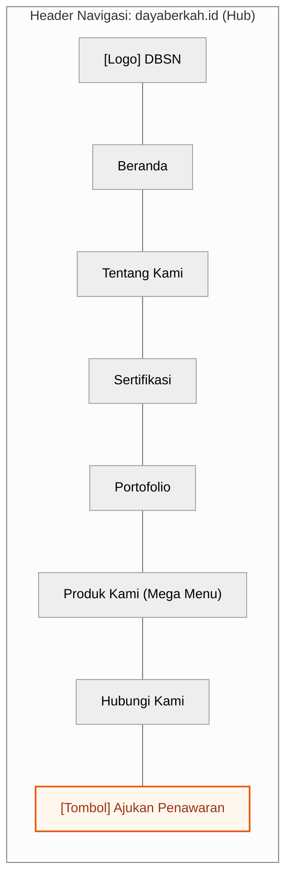

# Information Architecture Strategy & Global Navigation

> **OpenSpec SDD Lifecycle Mapping**: `MODIFIED: 2026-08-12 PRD v4.0.0 Greenfield Cascade`  
> **Authoritative Baseline Reference**: This document defines the Information Architecture (IA) strategy, Hub-and-Spoke navigation structure, and global navigation models for the **DBSN Centralized Digital Ecosystem**, fully synchronized with PRD v4.0.0 ([`prd.md`](file:///d:/dev/arostech-hub/docs/strategy/prd.md#L1-L120)) and the sitemap specification ([`sitemaps.md`](file:///d:/dev/arostech-hub/docs/system/architecture/information-architecture/sitemaps.md#L1-L50)).

---

## ## OpenSpec Delta

- **ADDED**: Greenfield PRD v4.0.0 Hub-and-Spoke navigation strategy, spoke subdomain dropdowns (`pju`, `solarcell`, `alatpetir`, `baterai`), and composite cart RFQ CTA patterns.
- **REMOVED**: Legacy multi-site navigation models, legacy 301 URL redirect maps, and legacy B2B/B2G form branching references.

---

## Section I: Information Architecture Strategy & Principles

### 1. Hub-and-Spoke Multi-Tenant Model

The Information Architecture SHALL be structured upon a Hub-and-Spoke model serving two core user mindsets across unified infrastructure:

| Attribute | B2G (Government / State-Owned) | B2B (Private Sector / EPC) |
| :--- | :--- | :--- |
| **Mindset** | Trust-first (Compliance Validation) | Efficiency-first (Specification Research) |
| **IA Priority** | Certifications & Portfolio in primary navigation | Direct access to Spoke catalogs & PDPs |
| **Primary Entry Point** | Hub (`dayaberkah.id`) | Product Spoke direct via SEO / Campaign |
| **Conversion Route** | Composite RFQ Form (B2G segment pre-fill) | Composite RFQ Form or WhatsApp fallback |
| **Post-RFQ Journey** | Client Dashboard Project Tracking | Client Dashboard Order Tracking |

---

## Section II: Core Design Principles

1. **Prominence of Trust Signals**: Certifications and Portfolio MUST be top-level navigation items rather than hidden sub-pages.
2. **Matrix Certification Access**: Organized by *type* at the Hub (`/certifications`) and *product relation* at Spokes.
3. **Scalable Spoke Templates**: All spoke subdomains SHALL follow identical IA structure; content is driven dynamically from Sanity CMS.
4. **Three-Level Depth Invariant**: Spoke Home → Product Catalog → Sub-category → Product Detail Page (PDP).
5. **Integrated Composite RFQ**: RFQ forms/modals MUST submit directly to `/api/rfq`.
6. **Indonesian Professional Standard**: All navigation labels SHALL use formal Indonesian terminology.
7. **Non-Blocking WhatsApp CTA**: Persistent floating button MUST remain visible across all pages without blocking form inputs.

---

## Section III: Global Navigation Systems

### 1. Hub Header Navigation (`dayaberkah.id`)



| Navigation Item | Type | Path / Target Behavior |
| :--- | :--- | :--- |
| **Beranda** | Direct Link | → `/` |
| **Tentang Kami** | Dropdown | → Corporate Profile (`/about`), Vision & Mission, Leadership |
| **Sertifikasi** | Direct Link | → `/certifications` (Centralized Certification Center) |
| **Portofolio** | Direct Link | → `/portfolio` (Project Showcase) |
| **Produk Kami** | Mega Menu | Gateway cards: PJU, Panel Surya, Penangkal Petir, Baterai |
| **Hubungi Kami** | Direct Link | → `/contact` |
| **Ajukan Penawaran** | Primary CTA | → Composite RFQ Modal / Form (`/contact`) |

---

## Section IV: Declarative Navigation Types

```typescript
export interface NavItem {
  label: string;
  href: string;
  isExternal?: boolean;
  badge?: string;
  children?: NavItem[];
}

export interface GlobalNavigationConfig {
  hubDomain: string;
  spokes: Array<{
    subdomain: 'pju' | 'solarcell' | 'alatpetir' | 'baterai';
    name: string;
    href: string;
  }>;
  mainNav: NavItem[];
}
```

---

## Section V: OpenSpec Behavioral Contracts

### Requirement: REQ-IA-001-NAVIGATION-STRATEGY
The system SHALL deliver consistent global navigation across Hub and Spoke subdomains and MUST route users seamlessly to composite RFQ conversion points.

#### Scenario: Spoke Cross-Navigation
- GIVEN a user navigating on `pju.dayaberkah.id`
- WHEN the user clicks the "← dayaberkah.id" back link
- THEN the browser MUST navigate to the main Hub root domain (`https://dayaberkah.id/`)
- AND it SHALL preserve any active UTM campaign tracking parameters.

---

## Section VI: Knowledge Graph Anchoring

- **Graphify Node**: `doc:docs/system/architecture/information-architecture/navigation-strategy.md`
- **Community**: `community_ia`
- **Authoritative Reference**: [`sitemaps.md`](file:///d:/dev/arostech-hub/docs/system/architecture/information-architecture/sitemaps.md#L1-L50)
