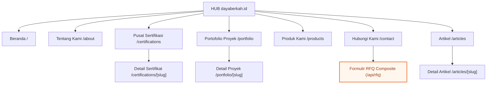

# Information Architecture Sitemaps & Route Mapping

> **TL;DR**: Authoritative specification and architectural reference for Information Architecture Sitemaps & Route Mapping within the DBSN platform (docs/system/architecture/information-architecture/sitemaps.md).


> **OpenSpec SDD Lifecycle Mapping**: `MODIFIED: 2026-08-12 PRD v4.0.0 Greenfield Cascade`  
> **Authoritative Baseline Reference**: This document defines the sitemap hierarchy, route tree, and URL structures for Hub (`dayaberkah.id`), Spokes (`[spoke].dayaberkah.id`), and Client Dashboard (`dashboard.dayaberkah.id`), fully synchronized with PRD v4.0.0 ([`prd.md`](file:///d:/dev/arostech-hub/docs/strategy/prd/00-overview-and-goals.md#L1-L120)).

---

## ## OpenSpec Delta

- **ADDED**: Complete route mapping for Hub, Spoke subdomains (`pju`, `solarcell`, `alatpetir`, `baterai`), and Client Dashboard (`dashboard.dayaberkah.id`) on Next.js 16 App Router.
- **REMOVED**: Legacy 301 redirect mapping tables and legacy static multi-site sitemaps.

---

## Section I: Hub Sitemap Structure (`dayaberkah.id`)

The Hub serves as the **Corporate Trust Center** for legal validation, certification matrix inspection, portfolio reviews, and spoke routing:



| Page Route | Purpose | Key Components |
| :--- | :--- | :--- |
| `/` | Homepage & Trust Center | Hero, Trust Badge Bar, Spoke Gateway Grid, Final CTA |
| `/about` | Corporate Profile & Credibility | Company Overview, Vision & Mission, Leadership |
| `/certifications` | Centralized Certification Matrix | Filterable list: SNI, TKDN, LKPP, ISO |
| `/portfolio` | Project Reference Showcase | Filterable grid by sector (Government, BUMN, Private) |
| `/products` | Product Gateway & Spoke Directory | Category overview cards routing to spoke subdomains |
| `/contact` | Inquiry & RFQ Submission | Contact info, Map, Composite Cart RFQ Form |
| `/articles` | Educational Articles & News | Article grid, Category filter |

---

## Section II: Spoke Sitemap Template (`[spoke].dayaberkah.id`)

Each product spoke subdomain SHALL follow a standardized sitemap template:

```
[spoke].dayaberkah.id/
├── /                                          → Spoke Homepage
├── /products                                  → Spoke Product Catalog & Listing
│   └── /products/[slug]                       → Product Detail Page (PDP)
├── /portfolio                                 → Spoke Project Portfolio
│   └── /portfolio/[slug]                      → Spoke Project Detail Page
├── /articles                                  → Spoke Content & Articles
│   └── /articles/[slug]                       → Spoke Article Detail Page
```

---

## Section III: Dashboard Sitemap (`dashboard.dayaberkah.id`)

The Client Dashboard is an operational portal restricted to authenticated users:

```
dashboard.dayaberkah.id/
├── /login                     → Login Page (Unauthenticated)
├── /forgot-password           → Password Reset Request
├── /reset-password            → Password Reset Execution
├── /                          → Dashboard Overview & Summary
├── /dashboard                 → Tracking Portal (Projects & Orders)
│   └── /[id]                  → Milestone Tracking Detail Page (Row-Level Security)
└── /profile                   → User Profile & Account Settings
```

---

## Section IV: Declarative Route Tree Interface

```typescript
export interface RouteNode {
  path: string;
  subdomain: 'hub' | 'pju' | 'solarcell' | 'alatpetir' | 'baterai' | 'dashboard';
  title: string;
  isProtected?: boolean;
  children?: RouteNode[];
}
```

---

## Section V: OpenSpec Behavioral Contracts

### Requirement: REQ-IA-002-SITEMAP-TREE
The system SHALL organize all pages into distinct, structured sitemap trees for Hub, Spokes, and Dashboard, and MUST serve accurate XML sitemaps dynamically via `sitemap.ts`.

#### Scenario: Dynamic Sitemap Generation
- GIVEN a search engine crawler requesting `https://dayaberkah.id/sitemap.xml`
- WHEN Next.js 16 executes `src/app/sitemap.ts`
- THEN it SHALL dynamically query published pages, products, and certifications from Sanity CMS
- AND it MUST output valid XML with canonical `https://dayaberkah.id` URIs.

---

## Section VI: Knowledge Graph Anchoring

- **Graphify Node**: `doc:docs/system/architecture/information-architecture/sitemaps.md`
- **Community**: `community_ia`
- **Authoritative Reference**: [`user-flows.md`](file:///d:/dev/arostech-hub/docs/system/architecture/information-architecture/user-flows.md#L1-L50)
