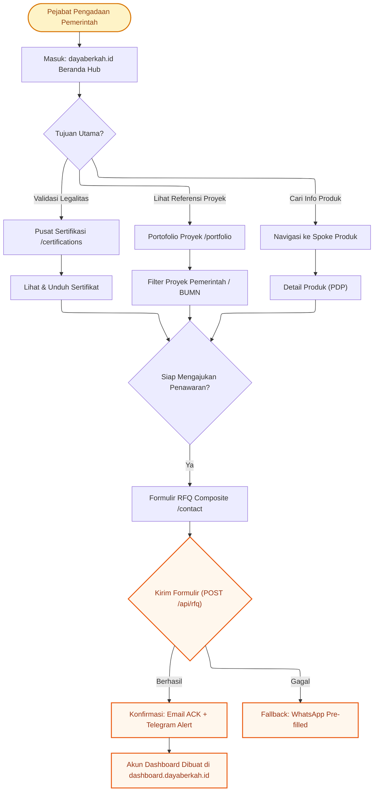
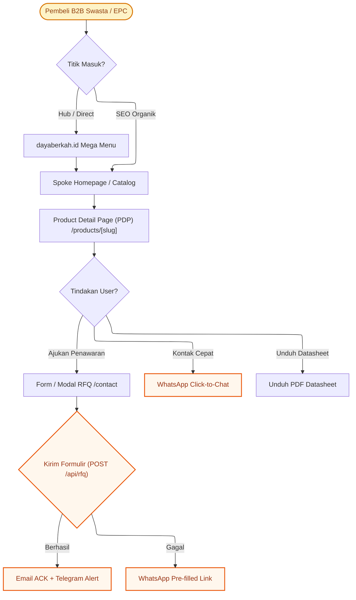

# Information Architecture Core User Flows & Conversion Pathways

> **TL;DR**: Authoritative specification and architectural reference for Information Architecture Core User Flows & Conversion Pathways within the DBSN platform (docs/system/architecture/information-architecture/user-flows.md).


> **OpenSpec SDD Lifecycle Mapping**: `MODIFIED: 2026-08-12 PRD v4.0.0 Greenfield Cascade`  
> **Authoritative Baseline Reference**: This document defines the primary user journeys, conversion pathways, and fallback mechanisms for B2G (Government Procurement) and B2B (Private Commercial Buyers) personas across the **DBSN Centralized Digital Ecosystem**, fully synchronized with PRD v4.0.0 ([`prd.md`](file:///d:/dev/arostech-hub/docs/strategy/prd/00-overview-and-goals.md#L1-L120)).

---

## ## OpenSpec Delta

- **ADDED**: Greenfield PRD v4.0.0 B2G and B2B user conversion pathways, composite cart RFQ ingestion flows, and WhatsApp pre-filled fallback mechanisms.
- **REMOVED**: Legacy single-form branching pathways and legacy redirect flow handlers.

---

## Section I: Core User Journeys

### 1. B2G User Flow (Government & State-Owned Enterprises)

**Persona:** Procurement Officer / PPK / BUMN Procurement Manager  
**Objective:** Validate vendor compliance (SNI/TKDN/LKPP), inspect reference project portfolio, and submit formal RFQ.  
**Primary Entry Point:** Hub (`dayaberkah.id`) via direct search or LKPP referral.



---

### 2. B2B User Flow (Private Commercial & EPC Engineers)

**Persona:** Procurement Manager / EPC Project Engineer / Facility Manager  
**Objective:** Research technical product specifications, download datasheets, and submit composite inquiry or contact sales via WhatsApp.  
**Primary Entry Point:** Product Spoke direct via organic search or campaign landing page.



---

## Section II: RFQ Failure Fallback Protocol

When the RFQ submission API (`POST /api/rfq`) returns a server error or times out:
1. The client form state MUST NOT be cleared.
2. The form serializer SHALL encode all cart items and contact fields into a pre-filled WhatsApp link (`https://wa.me/...`).
3. The UI SHALL render a full-width alert button: "Formulir Terkendala — Kirim via WhatsApp".

---

## Section III: Declarative User Session Event Types

```typescript
export interface UserFlowSessionEvent {
  eventId: string;
  timestamp: string;
  persona: 'B2G' | 'B2B' | 'UNKNOWN';
  entryPoint: string;
  pathHistory: string[];
  conversionAction?: 'RFQ_SUBMISSION' | 'WHATSAPP_CLICK' | 'DATASHEET_DOWNLOAD';
  rfqTrackingId?: string;
  fallbackTriggered: boolean;
}
```

---

## Section IV: OpenSpec Behavioral Contracts

### Requirement: REQ-IA-003-USER-FLOWS
The system SHALL support end-to-end user journeys for B2G and B2B personas, logging conversion analytics to GA4 and guaranteeing fallback handling if API ingestion fails.

#### Scenario: Fallback Trigger Validation
- GIVEN a user submitting an RFQ form on `/contact`
- WHEN the `/api/rfq` endpoint encounters a network timeout or 500 status
- THEN the application MUST NOT wipe user-entered form data
- AND it SHALL display the WhatsApp fallback button with pre-filled message text.

---

## Section V: Knowledge Graph Anchoring

- **Graphify Node**: `doc:docs/system/architecture/information-architecture/user-flows.md`
- **Community**: `community_ia`
- **Authoritative References**:
  - [`navigation-strategy.md`](file:///d:/dev/arostech-hub/docs/system/architecture/information-architecture/navigation-strategy.md#L1-L50)
  - [`sitemaps.md`](file:///d:/dev/arostech-hub/docs/system/architecture/information-architecture/sitemaps.md#L1-L50)
