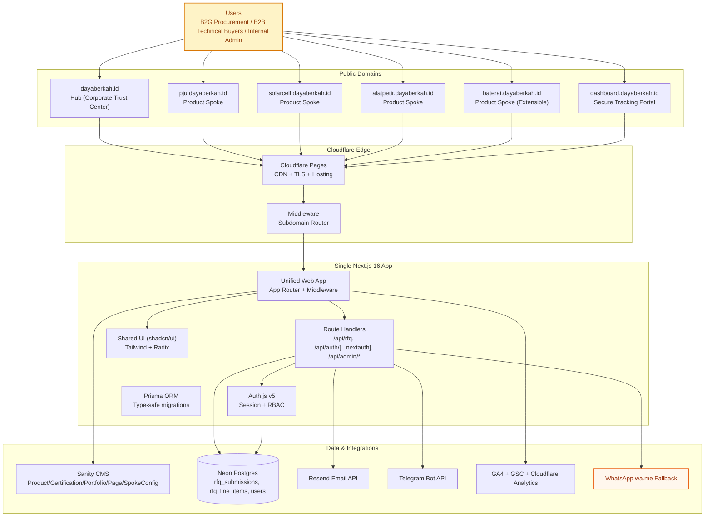

# System Architecture & Code Terrain Map Overview

> **OpenSpec SDD Lifecycle Mapping**: `MODIFIED: 2026-08-12 PRD v4.0.0 Baseline Sync`  
> **Authoritative Baseline Reference**: This document defines the high-level system architecture, data flow, and code terrain map for the **DBSN Centralized Digital Ecosystem**, fully synchronized with PRD v4.0.0 ([`prd.md`](file:///d:/dev/arostech-hub/docs/strategy/prd.md#L110-L170)) and the master roadmap ([`roadmap.md`](file:///d:/dev/arostech-hub/docs/strategy/roadmap.md#L21-L29)).

---

## Section I: System Topology & Component Mechanics

### 1. Architecture Overview

The DBSN platform SHALL operate as a Greenfield Hub-and-Spoke Sub-domain Architecture executed within a **single Next.js 16 application codebase**. Subdomain resolution MUST be driven at the edge via Next.js middleware without requiring divergent application deployments.

#### Core Tech Stack Summary
- **Application Runtime:** Next.js 16 (App Router, Route Handlers, Server Components, enhanced caching)
- **Repository Strategy:** Single Next.js 16 app with pnpm package manager
- **Content Layer:** Sanity.io (headless CMS, schema-driven content federation)
- **UI System:** Tailwind CSS v4 + Radix UI with shadcn/ui patterns (shared tokenized design system)
- **Transactional Data Layer:** Neon Postgres via Prisma ORM (type-safe migrations)
- **Authentication:** Auth.js v5 (role-based access: `admin`, `viewer`, `client`)
- **Hosting / Edge:** Cloudflare Pages (via `@cloudflare/next-on-pages` edge runtime)
- **Notifications:** Resend (email), Telegram Bot API (internal ops alerting)
- **Telemetry:** GA4 + GSC + Cloudflare Analytics
- **Messaging Fallback:** WhatsApp `wa.me` pre-filled fallback for RFQ failure path

#### High-Level System Topology (Hub-and-Spoke)

---

## Section II: Component Breakdown

### 1. Frontend Architecture
- **Runtime + Routing:** Next.js 16 App Router with middleware-based subdomain routing (`src/proxy.ts` / edge middleware).
- **Domain Surfaces:**
  - Hub: Corporate trust center (`dayaberkah.id`) hosting company profile, certifications, and portfolio.
  - Product spokes: Specialized vertical landing pages and cart entry (`pju.dayaberkah.id`, `solarcell.dayaberkah.id`, `alatpetir.dayaberkah.id`, `baterai.dayaberkah.id`).
  - Dashboard spoke: Secure client tracking portal (`dashboard.dayaberkah.id`).
- **UI System:** Shared Tailwind v4 design tokens and Radix UI components (shadcn/ui patterns).
- **Mobile-First Policy:** All touch targets SHALL be minimum 44px with zero horizontal scroll on 320px viewports.

### 2. Backend Architecture
- **API Engine:** Route Handlers under `/api/*` executing within Next.js 16 App Router.
- **Core Endpoints:**
  - `POST /api/rfq` — Ingests universal composite RFQ cart submissions (`rfqSubmissionSchema`).
  - `GET/POST /api/auth/[...nextauth]` — Auth.js v5 catch-all handling OAuth and Credentials sessions.
  - `POST /api/revalidate` — Sanity ISR cache tag revalidation webhook handler.
- **Data Ingestion & Integrity:**
  - Server-side Zod schema validation MUST be enforced on all write operations.
  - Database persistence SHALL target Neon Postgres via Prisma ORM (`leads` / `rfq_submissions`, `rfq_line_items`, `users`).

---

## Section III: Behavioral Contracts

### Requirement: REQ-ARCH-001-SUBDOMAIN-ROUTING
The edge middleware MUST inspect inbound Host headers and route traffic to the appropriate route group or subdomain surface without performing external 301 redirects.

#### Scenario: Edge Middleware Subdomain Resolution
- GIVEN an HTTP request arriving for `pju.dayaberkah.id`
- WHEN the request passes through Cloudflare Pages edge middleware
- THEN the system MUST rewrite the request internally to the product spoke route handler
- AND preserve host context for header and analytical tag attribution.

### Requirement: REQ-ARCH-002-UNIFIED-DATA-PIPELINE
All product spoke inquiries MUST funnel through a single transactional Neon Postgres database via Prisma ORM and trigger unified telemetry alerts.

#### Scenario: Universal Ingestion and Session Provisioning
- GIVEN a buyer submitting a quote request on any product spoke subdomain
- WHEN the submission is successfully written to the Neon Postgres database
- THEN the system MUST trigger parallel Resend email and Telegram Bot notifications
- AND allow authenticated client session resolution via `/api/auth/session`.

---

## Section IV: Executive Phase Status Synchronization

The operational phase status across the architecture MUST match PRD v4.0.0 ([`prd.md`](file:///d:/dev/arostech-hub/docs/strategy/prd.md#L22-L35)) and `roadmap.md` ([`roadmap.md`](file:///d:/dev/arostech-hub/docs/strategy/roadmap.md#L21-L29)) exactly:

| Phase | Milestone Title | Architecture Phase Status | Synchronized Baseline Notes |
|-------|-----------------|--------------------------|-----------------------------|
| **Phase 1** | Foundation & Core Architecture | **COMPLETE** | Next.js 16, pnpm, Tailwind v4, Prisma ORM setup complete. |
| **Phase 2** | Core Features & Universal RFQ | **COMPLETE** | Edge middleware, Universal RFQ cart schema, Sanity CMS operational. |
| **Phase 3** | Infrastructure & Auth.js v5 | **COMPLETE** | Greenfield Cloudflare Pages hosting & client tracking portal deployed. |
| **Phase 4** | Quality Gates & E2E Validation | **NOT STARTED** | Performance profiling (PSI 90+), security audit, Playwright E2E suite. |

---

## Section V: Graphify Anchoring & References

- Knowledge Graph Node ID: `doc:docs/system/architecture/overview.md`
- Graphify Community: `community_architecture`
- Authoritative PRD Reference: [`prd.md`](file:///d:/dev/arostech-hub/docs/strategy/prd.md#L110-L170)
- Master Roadmap Reference: [`roadmap.md`](file:///d:/dev/arostech-hub/docs/strategy/roadmap.md#L21-L29)
- Execution Lifecycle Reference: [`execution-lifecycle.md`](file:///d:/dev/arostech-hub/docs/system/architecture/execution-lifecycle.md#L1-L98)
- System Data Model Reference: [`data-model.md`](file:///d:/dev/arostech-hub/docs/system/data-model.md#L1-L150)