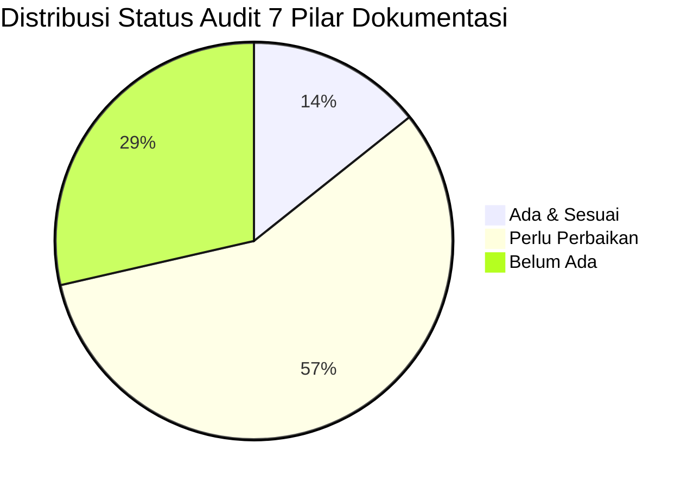
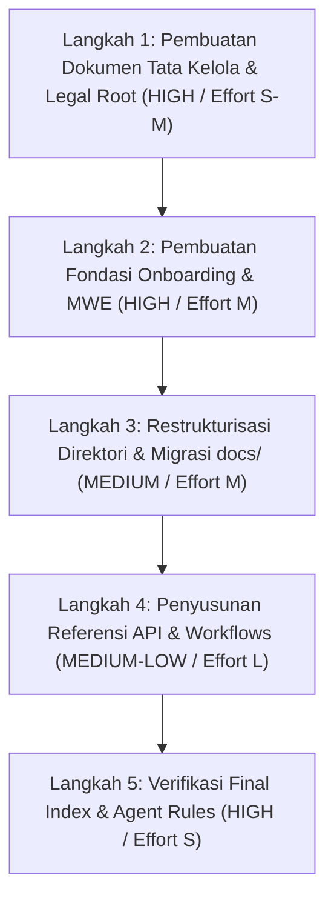

# Rencana Analisis & Restrukturisasi Dokumentasi Repositori
**PT Daya Berkah Sentosa Nusantara (DBSN) Centralized Digital Ecosystem**

> **Metadata Dokumen**  
> - **Peran Penyusun**: High-Level Software Documentation Architect (Antigravity Harness)  
> - **Status Framework**: OpenSpec Extended Workflow & ECC Workflow Compatible  
> - **Mode Operasi**: Read-Only Audit & Strategic Planning Phase  
> - **Tanggal Penyusunan**: 7 Agustus 2026  

---

## Ringkasan Eksekutif

Dokumen ini menyajikan hasil eksplorasi sistematis, audit kepatuhan 7 pilar dokumentasi perangkat lunak tingkat tinggi, serta rencana restrukturisasi (actionable blueprint) untuk repositori **DBSN Centralized Digital Ecosystem** (`arostech-hub`). 

Tujuan utama restrukturisasi ini adalah mengubah dokumentasi terfragmentasi menjadi satu **Single Source of Truth** yang terorganisir secara hirarkis, mudah diparsing oleh pengembang manusia maupun agen AI otonom, serta memenuhi standar tata kelola dan keamanan enterprise.

---

## FASE 1: Inventarisasi & Pemetaan Dokumentasi Awal (Baseline Inventory)

Hasil pemindaian *read-only* pada struktur direktori repositori mencatat **54 berkas dokumentasi & panduan** yang terbagi dalam berkas root, direktori `docs/`, modul `.agents/`, serta konfigurasi `openspec/`.

### 1.1 Berkas Dokumentasi Root (Root Files)

| Nama Berkas | Lokasi | Cakupan & Deskripsi Singkat | Status Quality Baseline |
| :--- | :--- | :--- | :--- |
| `README.md` | `/README.md` | Ringkasan platform, topologi sistem, tech stack, local setup (`lvh.me`), CLI commands, dan secrets Cloudflare Pages. | **Aktif / Cukup Baik** |
| `AGENTS.md` | `/AGENTS.md` | Aturan utama Antigravity CLI (`agy`), hirarki aturan, mode dokumentasi, topologi domain, dan integrasi MCP. | **Aktif / Sangat Baik** |
| `ORIGINAL_REQUEST.md` | `/ORIGINAL_REQUEST.md` | Dokumen historis prompt/kebutuhan awal proyek. | **Arsip / Pasif** |

> **Catatan Temuan Utama**: Berkas standar tata kelola root seperti `CONTRIBUTING.md`, `SECURITY.md`, `LICENSE`, dan `CHANGELOG.md` **saat ini belum ada (MISSING)**.

---

### 1.2 Direktori Utama Dokumentasi (`docs/`)

```
docs/
├── CODEMAPS/
│   ├── architecture.md
│   ├── backend.md
│   ├── data.md
│   ├── dependencies.md
│   └── frontend.md
├── adr/
│   ├── 0001-migrate-fully-to-cloudflare-pages.md
│   ├── 0002-explicit-cloudflare-pages-deploy-command.md
│   ├── README.md
│   └── template.md
├── archive/
│   ├── design-system.md
│   ├── vercel-deployment.md
│   ├── plans/
│   ├── reviews/
│   └── specs/
├── audits/
│   ├── developer-fix-guide.md
│   ├── integration-health-audit-2026-07-14.md
│   ├── landing-page-ux-audit-2026-07-09.md
│   ├── verify-manual-tasks-prompt.md
│   └── lighthouse/
├── core/
│   ├── project-roadmap.md
│   ├── architecture/
│   │   ├── architecture.md
│   │   ├── dns-cutover-mapping.md
│   │   ├── middleware-routing.md
│   │   └── tdd-v1.md
│   ├── business-context/
│   │   └── DBSN_Bussiness-Context.md
│   ├── development/
│   │   ├── cloudflare-deployment.md
│   │   ├── gsc-setup.md
│   │   ├── local-setup.md
│   │   ├── sanity-cms-guide.md
│   │   └── testing-guide.md
│   ├── information-architecture/
│   │   ├── ia-sitemaps.md
│   │   ├── ia-strategy-navigation.md
│   │   ├── ia-user-flows.md
│   │   └── information-architecture.md
│   ├── prd/
│   │   ├── prd-c-level-segment-focus.md
│   │   └── prd-v3.md
│   └── testing/
│       └── mocking-specs.md
├── superpowers/
│   ├── plans/
│   └── specs/
├── ONBOARDING.md
└── README.md
```

---

### 1.3 Berkas Konfigurasi & AI Rules Sub-system

| Nama Berkas / Path | Fungsi & Cakupan |
| :--- | :--- |
| `.agents/rules/documentation-mode.md` | Aturan pembatasan write/edit agent saat Documentation Mode aktif. |
| `.agents/rules/prompt-lab.md` | Pedoman formulasi prompt dan benchmark agent. |
| `.agent/workflows/*.md` | 12 Alur kerja OpenSpec (OPSX) untuk eksplorasi, penyesuaian, dan verifikasi. |
| `.agent/skills/*.md` | Skill-skill eksekusi OpenSpec dan spesifikasi agentic. |
| `openspec/` | Direktori penyimpanan spesifikasi utama (`specs/`) dan delta perubahannya (`changes/`). |

---

## FASE 2: Audit Kepatuhan & Analisis Gap (7 Pilar Standar Framework)

Evaluasi kondisi dokumentasi dilakukan secara obyektif berdasarkan **7 Pilar Standar Dokumentasi Software Development Framework**:



---

### Audit Detail 7 Pilar

#### 1. Identitas, Visi, & Ruang Lingkup (System Identity & Scope)
- **Problem Statement & Core Value**: Terdefinisi dengan jelas di `README.md` dan `DBSN_Bussiness-Context.md` (konsolidasi 3 WordPress legacy ke Next.js 16 Edge Hub-and-Spoke).
- **Design Philosophy**: Tersirat di `AGENTS.md` & `architecture.md` (Edge-first, TDD, Convention over configuration).
- **Compatibility Matrix**: Tersebar parsial. Belum ada tabel spesifikasi resmi mengenai matriks kompatibilitas versi (Runtime Node.js, Cloudflare Edge Runtime limit, Prisma Serverless Edge Driver, browser support).
- **Status Audit**: **[Perlu Perbaikan]**

#### 2. Panduan Onboarding & Penggunaan Awal (Quick Start)
- **Prerequisites & Local Setup**: Terkonfigurasi baik di `docs/ONBOARDING.md` dan `docs/core/development/local-setup.md` menggunakan `lvh.me`.
- **Minimal Working Example (MWE)**: Belum ada panduan MWE/Boilerplate terisolasi yang memandu developer baru menambahkan Spoke produk baru atau menambahkan API endpoint dari nol secara langkah-demi-langkah.
- **Status Audit**: **[Perlu Perbaikan]**

#### 3. Arsitektur & Konsep Inti (Architecture & Core Mechanics)
- **High-Level System Diagram**: Terdefinisi dengan baik menggunakan Mermaid di `README.md` dan `docs/core/architecture/architecture.md`.
- **Directory Structure & Lifecycle**: Terpetakan detail di `CODEMAPS/` (frontend, backend, data, dependencies, architecture) dan `middleware-routing.md`.
- **Architecture Decision Records (ADR)**: Struktur ADR aktif di `docs/adr/` (ADR-0001 Cloudflare Pages, ADR-0002 Deploy Command).
- **Status Audit**: **[Ada & Sesuai]**

#### 4. Referensi API & Ekstensibilitas (API Reference & Extensibility)
- **Public API Contracts**: Spesifikasi API tersebar di PRD v3.1 dan `CODEMAPS/backend.md`. Belum ada dokumentasi OpenAPI/Zod contract terpusat (`docs/api/`) untuk endpoint `/api/rfq`, `/api/auth/*`, dan `/api/revalidate`.
- **Configuration Schema**: Variabel lingkungan dijelaskan di `README.md` & `.env.example`, namun belum ada tabel referensi skema lengkap yang mencatat tipe data, default value, optionality, serta binding scope Cloudflare Pages.
- **Extension & Plugin Architecture**: Panduan pembuatan Spoke baru atau plugin Sanity Studio custom belum terdokumentasi.
- **Status Audit**: **[Perlu Perbaikan]**

#### 5. Tata Kelola & Alur Kerja Kontribusi (Governance & Workflow)
- **Contribution Guidelines**: Berkas `CONTRIBUTING.md` **[Belum Ada]** di root repositori. Belum ada panduan baku mengenai git branching model (`main`, `feature/*`), Conventional Commits policy, serta Pull Request checklist.
- **Coding Standards & Style Guide**: Panduan style guide & ESLint/Tailwind v4 tokens tercantum parsial, namun belum disatukan dalam dokumen tata kelola code style.
- **AI Context Rules**: Sangat baik dan lengkap pada `AGENTS.md` dan `.agents/rules/documentation-mode.md`.
- **Status Audit**: **[Belum Ada]**

#### 6. Pengujian, Rilis, & Manajemen Perubahan (QA & Lifecycle)
- **Testing Strategy**: Sangat detail pada `docs/core/development/testing-guide.md`, `tdd-v1.md`, dan `mocking-specs.md` (Jest & Playwright).
- **Versioning & Changelog**: Berkas `CHANGELOG.md` **[Belum Ada]** di root. Belum ada dokumentasi baku alur Semantic Versioning (SemVer) dan rilis tag Cloudflare Pages.
- **Status Audit**: **[Perlu Perbaikan]**

#### 7. Keamanan & Lisensi Hukum (Security & Legal Compliance)
- **Security Policy**: Berkas `SECURITY.md` **[Belum Ada]** di root. Belum ada standar pelaporan kerentanan (vulnerability disclosure policy), penanganan secrets Cloudflare, dan kontak keamanan perusahaan.
- **License**: Berkas `LICENSE` / `LICENSE.md` **[Belum Ada]** di root.
- **Status Audit**: **[Belum Ada]**

---

### Tabel Ringkasan Audit Kepatuhan 7 Pilar

| No | Pilar Dokumentasi | Status Audit | Temuan Utama / Gap | Impact Level |
| :---: | :--- | :---: | :--- | :---: |
| 1 | Identitas, Visi, & Ruang Lingkup | **[Perlu Perbaikan]** | Belum ada Compatibility Matrix resmi (runtime/OS/Cloudflare limit). | Medium |
| 2 | Panduan Onboarding & Penggunaan Awal | **[Perlu Perbaikan]** | Belum ada Minimal Working Example (MWE) untuk penambahan Spoke/API. | High |
| 3 | Arsitektur & Konsep Inti | **[Ada & Sesuai]** | Arsitektur, C4 diagram, middleware, dan ADR sudah sangat lengkap. | Low |
| 4 | Referensi API & Ekstensibilitas | **[Perlu Perbaikan]** | Tidak ada spesifikasi API terpusat (`docs/api/`) & Schema Config rincian. | Medium |
| 5 | Tata Kelola & Alur Kerja Kontribusi | **[Belum Ada]** | Berkas `CONTRIBUTING.md`, PR checklist, & Branching Guide **MISSING**. | High |
| 6 | Pengujian, Rilis, & Manajemen Perubahan | **[Perlu Perbaikan]** | Testing sangat kuat, tetapi `CHANGELOG.md` & SemVer release strategy missing. | Medium |
| 7 | Keamanan & Lisensi Hukum | **[Belum Ada]** | Berkas `SECURITY.md` & `LICENSE` di root **MISSING**. | High |

---

## FASE 3: Rencana Restrukturisasi (Actionable Blueprint)

FASE 3 memberikan rencana aksi konkrit dan sistematis untuk mewujudkan dokumentasi berstandar *high-level framework*. Rencana ini dirancang agar aman dieksekusi oleh developer internal maupun agen AI pada iterasi berikutnya.

### 3.1 Target Struktur Direktori Dokumentasi Baru

```
arostech-hub/
├── README.md                           # Core System Portal & Executive Overview (Modifikasi)
├── AGENTS.md                           # AI Agent System Identity & Operational Rules (Modifikasi)
├── CONTRIBUTING.md                     # [BARU] Contribution Guidelines, Git Flow & PR Checklist
├── SECURITY.md                         # [BARU] Vulnerability Disclosure & Secrets Policy
├── LICENSE                             # [BARU] Proprietary / Open Source License File
├── CHANGELOG.md                        # [BARU] Version History & Semantic Versioning Log
├── docs/
│   ├── README.md                       # Canonical Documentation Hub Index (Modifikasi)
│   ├── ONBOARDING.md                   # Day-1 Checklist & Developer Setup (Modifikasi)
│   ├── system/                         # [RESTRUKTURISASI dari core/architecture & business-context]
│   │   ├── identity-and-scope.md       # [BARU] Vision, Philosophy & Compatibility Matrix
│   │   ├── architecture.md             # High-Level Architecture, Topology & C4 Diagrams
│   │   ├── middleware-routing.md       # Subdomain Edge Routing & Execution Chain
│   │   ├── dns-cutover-mapping.md      # Domain & DNS Cutover Mapping
│   │   └── business-context.md         # Corporate Business Context (BMC, PESTLE, SWOT)
│   ├── mwe/                            # [BARU] Minimal Working Examples & Extension Guides
│   │   ├── add-new-spoke.md            # [BARU] Step-by-step guide adding a product spoke
│   │   └── add-api-endpoint.md         # [BARU] Step-by-step guide adding a secure API route
│   ├── api/                            # [BARU] Centralized API Contracts & Config Schemas
│   │   ├── api-reference.md            # [BARU] Public API Contracts (RFQ, Auth, Revalidation)
│   │   └── env-configuration-schema.md # [BARU] Comprehensive Environment Variable Reference
│   ├── workflow/                       # [BARU] Governance & AI Coordination
│   │   ├── coding-standards.md         # [BARU] TypeScript, Tailwind v4, React 19 Style Guide
│   │   ├── ecc-openspec-workflow.md    # [BARU] Integration of ECC & OpenSpec Extended Workflows
│   │   └── release-management.md       # [BARU] SemVer Release Strategy & Cloudflare Deploy Pipeline
│   ├── codemaps/                       # [NAMA BARU: lowercase dari CODEMAPS]
│   │   ├── architecture.md
│   │   ├── backend.md
│   │   ├── data.md
│   │   ├── dependencies.md
│   │   └── frontend.md
│   ├── adr/                            # Architecture Decision Records
│   │   ├── 0001-migrate-fully-to-cloudflare-pages.md
│   │   ├── 0002-explicit-cloudflare-pages-deploy-command.md
│   │   ├── README.md
│   │   └── template.md
│   ├── development/                    # Developer Field Manuals
│   │   ├── local-setup.md
│   │   ├── cloudflare-deployment.md
│   │   ├── sanity-cms-guide.md
│   │   ├── testing-guide.md
│   │   └── gsc-setup.md
│   ├── ia/                             # [NAMA BARU: disederhanakan dari information-architecture]
│   │   ├── index.md
│   │   ├── sitemaps.md
│   │   ├── strategy-navigation.md
│   │   └── user-flows.md
│   ├── prd/                            # Product Requirements Documents
│   │   ├── prd-v3.md
│   │   └── prd-c-level-segment-focus.md
│   ├── testing/                        # Testing Specs & Mocks
│   │   └── mocking-specs.md
│   ├── audits/                         # Historical & Technical Audits
│   │   ├── developer-fix-guide.md
│   │   ├── integration-health-audit-2026-07-14.md
│   │   ├── landing-page-ux-audit-2026-07-09.md
│   │   ├── verify-manual-tasks-prompt.md
│   │   └── lighthouse/
│   └── archive/                        # Superseded & Legacy Documents
```

---

### 3.2 Matriks Pemetaan & Migrasi Dokumen

| Berkas Lama (Path Saat Ini) | Berkas Baru (Path Target) | Tipe Aksi | Rasionil Restrukturisasi |
| :--- | :--- | :---: | :--- |
| *Tidak Ada* | `/CONTRIBUTING.md` | **[Buat Baru]** | Memenuhi Pilar 5 (Governance & Contributing). |
| *Tidak Ada* | `/SECURITY.md` | **[Buat Baru]** | Memenuhi Pilar 7 (Security Policy). |
| *Tidak Ada* | `/LICENSE` | **[Buat Baru]** | Memenuhi Pilar 7 (Legal Compliance). |
| *Tidak Ada* | `/CHANGELOG.md` | **[Buat Baru]** | Memenuhi Pilar 6 (Versioning Log). |
| *Tidak Ada* | `docs/system/identity-and-scope.md` | **[Buat Baru]** | Memenuhi Pilar 1 (Philosophy & Compatibility Matrix). |
| *Tidak Ada* | `docs/mwe/add-new-spoke.md` | **[Buat Baru]** | Memenuhi Pilar 2 (Quick Start / MWE Spoke). |
| *Tidak Ada* | `docs/mwe/add-api-endpoint.md` | **[Buat Baru]** | Memenuhi Pilar 2 (Quick Start / MWE API). |
| *Tidak Ada* | `docs/api/api-reference.md` | **[Buat Baru]** | Memenuhi Pilar 4 (Public API Contracts). |
| *Tidak Ada* | `docs/api/env-configuration-schema.md` | **[Buat Baru]** | Memenuhi Pilar 4 (Configuration Schema). |
| *Tidak Ada* | `docs/workflow/coding-standards.md` | **[Buat Baru]** | Memenuhi Pilar 5 (Style Guide & Standards). |
| *Tidak Ada* | `docs/workflow/ecc-openspec-workflow.md` | **[Buat Baru]** | Memenuhi Pilar 5 (AI Context & ECC/OpenSpec Integration). |
| *Tidak Ada* | `docs/workflow/release-management.md` | **[Buat Baru]** | Memenuhi Pilar 6 (Release & Deployment Lifecycle). |
| `docs/core/architecture/*` | `docs/system/*` | **[Migrasi]** | Mengkonsolidasi arsitektur ke folder `system/`. |
| `docs/core/business-context/*` | `docs/system/business-context.md` | **[Migrasi]** | Menyederhanakan penamaan dan kedalaman folder. |
| `docs/CODEMAPS/*` | `docs/codemaps/*` | **[Karakter]** | Standarisasi penamaan folder menjadi lowercase. |
| `docs/core/information-architecture/*` | `docs/ia/*` | **[Migrasi]** | Memperpendek path direktori tanpa mengubah makna. |

---

### 3.3 Daftar Dokumen Baru yang Harus Dibuat

Berikut adalah rincian spesifik berkas baru yang wajib dibuat pada tahap eksekusi berikutnya. Penentuan label **Prioritas** diturunkan secara langsung dari temuan status audit FASE 2:
- **High Priority**: Berkas status **[Belum Ada]** pada pilar kritikal onboarding, tata kelola, keamanan, dan lisensi hukum (Pilar 2, 5, 7).
- **Medium Priority**: Berkas status **[Belum Ada] / [Perlu Perbaikan]** pada pilar arsitektur & API (Pilar 1, 4, 6).
- **Low Priority**: Berkas penyempurnaan/panduan opsional.

```mermaid
quadrantChart
    title Matriks Prioritas & Effort Dokumen Baru
    x-axis Low Effort --> High Effort
    y-axis Low Priority --> High Priority
    quadrant-1 Eksekusi Utama (High Priority, High Effort)
    quadrant-2 Quick Wins (High Priority, Low Effort)
    quadrant-3 Dokumen Pelengkap (Low Priority, Low Effort)
    quadrant-4 Dokumen Strategis (Low Priority, High Effort)
    "SECURITY.md": [0.25, 0.90]
    "LICENSE": [0.15, 0.88]
    "CONTRIBUTING.md": [0.45, 0.85]
    "add-new-spoke.md": [0.40, 0.80]
    "CHANGELOG.md": [0.20, 0.75]
    "api-reference.md": [0.75, 0.65]
    "env-configuration-schema.md": [0.50, 0.60]
    "identity-and-scope.md": [0.40, 0.55]
    "release-management.md": [0.55, 0.50]
    "coding-standards.md": [0.35, 0.40]
```

#### Detailed Breakdown Dokumen Baru:

1. **`SECURITY.md` (Root)**
   - **Pilar**: Pilar 7 (Keamanan & Lisensi Hukum)
   - **Prioritas**: **High** (Status audit FASE 2: [Belum Ada])
   - **Estimasi Effort**: **S** (~1-2 jam kerja)
   - **Ringkasan Poin Isi**: Policy pelaporan kerentanan (Vulnerability Reporting), instruksi kontak keamanan `[Gunakan kontak keamanan perusahaan]`, standar penanganan secrets Cloudflare Pages (`.dev.vars`, Encrypted Secrets), dan skema mitigasi DDoS/WAF Cloudflare.

2. **`LICENSE` (Root)**
   - **Pilar**: Pilar 7 (Keamanan & Lisensi Hukum)
   - **Prioritas**: **High** (Status audit FASE 2: [Belum Ada])
   - **Estimasi Effort**: **S** (~0.5 jam kerja)
   - **Ringkasan Poin Isi**: Deklarasi lisensi legal resmi repositori `[Tentukan lisensi perangkat lunak, contoh: Proprietary PT DBSN / MIT]`.

3. **`CONTRIBUTING.md` (Root)**
   - **Pilar**: Pilar 5 (Tata Kelola & Alur Kerja Kontribusi)
   - **Prioritas**: **High** (Status audit FASE 2: [Belum Ada])
   - **Estimasi Effort**: **M** (~2-3 jam kerja)
   - **Ringkasan Poin Isi**: Panduan branching strategy (`main`, `feature/*`, `fix/*`), aturan Conventional Commits (`feat:`, `fix:`, `docs:`), tata cara Pull Request, checklist pengujian wajib (`pnpm lint`, `pnpm test`, `pnpm pages:build`), dan instruksi menjalankan agentik CLI.

4. **`docs/mwe/add-new-spoke.md`**
   - **Pilar**: Pilar 2 (Panduan Onboarding & Minimal Working Example)
   - **Prioritas**: **High** (Status audit FASE 2: [Perlu Perbaikan])
   - **Estimasi Effort**: **M** (~3-4 jam kerja)
   - **Ringkasan Poin Isi**: Step-by-step MWE membuat Spoke produk baru (misal: `pompa.dayaberkah.id`), pemetaan folder `src/app/(spokes)/[spoke]`, konfigurasi `middleware.ts`, pendaftaran Sanity document type, dan pembuatan halaman terisolasi.

5. **`CHANGELOG.md` (Root)**
   - **Pilar**: Pilar 6 (Pengujian, Rilis, & Manajemen Perubahan)
   - **Prioritas**: **High** (Status audit FASE 2: [Belum Ada])
   - **Estimasi Effort**: **S** (~1 jam kerja)
   - **Ringkasan Poin Isi**: Catatan perubahan histori rilis proyek berdasarkan konvensi Keep a Changelog & Semantic Versioning (v1.0.0, v1.1.0).

6. **`docs/api/api-reference.md`**
   - **Pilar**: Pilar 4 (Referensi API & Ekstensibilitas)
   - **Prioritas**: **Medium** (Status audit FASE 2: [Perlu Perbaikan])
   - **Estimasi Effort**: **L** (~5-6 jam kerja)
   - **Ringkasan Poin Isi**: Kontrak API publik terpusat mencakup skema Zod & payload JSON untuk `/api/rfq` (submisi RFQ + fallback Telegram/WhatsApp), `/api/auth/*` (Auth.js v5 JWT sessions), dan `/api/revalidate` (Sanity ISR Webhook).

7. **`docs/api/env-configuration-schema.md`**
   - **Pilar**: Pilar 4 (Referensi API & Ekstensibilitas)
   - **Prioritas**: **Medium** (Status audit FASE 2: [Perlu Perbaikan])
   - **Estimasi Effort**: **M** (~2-3 jam kerja)
   - **Ringkasan Poin Isi**: Tabel komprehensif skema environment variables mencakup nama variabel, deskripsi, tipe data, status wajib/opsional, default value, serta lokasi binding (`.env.local`, `.dev.vars`, atau Cloudflare Encrypted Secret).

8. **`docs/system/identity-and-scope.md`**
   - **Pilar**: Pilar 1 (Identitas, Visi, & Ruang Lingkup)
   - **Prioritas**: **Medium** (Status audit FASE 2: [Perlu Perbaikan])
   - **Estimasi Effort**: **M** (~2-3 jam kerja)
   - **Ringkasan Poin Isi**: Pernyataan masalah bisnis, nilai inti platform, filosofi desain (Edge-first, TDD, convention over configuration), serta Matriks Kompatibilitas Runtime resmi (Node.js 20+, Next.js 16.2.6, Tailwind v4, Cloudflare Edge limits).

9. **`docs/workflow/release-management.md`**
   - **Pilar**: Pilar 6 (Pengujian, Rilis, & Manajemen Perubahan)
   - **Prioritas**: **Medium** (Status audit FASE 2: [Perlu Perbaikan])
   - **Estimasi Effort**: **M** (~2-3 jam kerja)
   - **Ringkasan Poin Isi**: Alur rilis perangkat lunak, integrasi CI/CD Cloudflare Pages, instruksi `pnpm pages:build` & `pnpm pages:deploy`, serta kriteria rilis launch gates.

10. **`docs/workflow/coding-standards.md`**
    - **Pilar**: Pilar 5 (Tata Kelola & Alur Kerja Kontribusi)
    - **Prioritas**: **Low** (Status audit FASE 2: [Perlu Perbaikan])
    - **Estimasi Effort**: **S** (~2 jam kerja)
    - **Ringkasan Poin Isi**: Standar penulisan kode TypeScript 5.7+, struktur React 19 Server Components, konvensi Tailwind CSS v4 design tokens, dan penanganan error terstruktur.

11. **`docs/workflow/ecc-openspec-workflow.md`**
    - **Pilar**: Pilar 5 (AI Context Rules & Governance)
    - **Prioritas**: **Low** (Status audit FASE 2: [Perlu Perbaikan])
    - **Estimasi Effort**: **M** (~2-3 jam kerja)
    - **Ringkasan Poin Isi**: Panduan kolaborasi agen AI menggunakan OpenSpec Extended Workflow (`openspec/`), konvensi perancangan change (`proposal.md`, `specs/`, `design.md`, `tasks.md`), dan interaksi harness Antigravity CLI `[Sesuaikan dengan konvensi ECC/OpenSpec tim]`.

---

### 3.4 Urutan Langkah Eksekusi (Actionable Execution Plan)

Urutan langkah dieksekusi dalam **4 Fase Berurutan** untuk menjamin keamanan repositori dan konsistensi migrasi.



#### Rincian Langkah Eksekusi:

| No | Langkah Eksekusi | Deskripsi Tindakan | Target Berkas / Directory | Prioritas | Estimasi Effort |
| :---: | :--- | :--- | :--- | :---: | :---: |
| **1** | **Fondasi Governance Root** | Buat berkas tata kelola, keamanan, rilis, dan lisensi di root repositori. | `SECURITY.md`, `LICENSE`, `CONTRIBUTING.md`, `CHANGELOG.md` | **High** | **M** (~4-5 jam) |
| **2** | **Onboarding & MWE Spoke** | Buat panduan MWE terisolasi untuk pembuatan Spoke dan API baru. Update `docs/ONBOARDING.md`. | `docs/mwe/add-new-spoke.md`, `docs/mwe/add-api-endpoint.md`, `docs/ONBOARDING.md` | **High** | **M** (~4-5 jam) |
| **3** | **Migrasi & Restrukturisasi Folder** | Buat direktori baru (`docs/system/`, `docs/api/`, `docs/workflow/`, `docs/ia/`, `docs/codemaps/`) dan pindahkan berkas eksis sesuai Matriks Migrasi (3.2). Update link internal. | Direktori `docs/` | **Medium** | **M** (~3-4 jam) |
| **4** | **Penyusunan API & System Docs** | Susun dokumen referensi API terpusat, skema variabel lingkungan, serta spesifikasi Identitas & Sistem Scope. | `docs/api/api-reference.md`, `docs/api/env-configuration-schema.md`, `docs/system/identity-and-scope.md` | **Medium** | **L** (~8-10 jam) |
| **5** | **Penyusunan Workflow & Standards** | Buat panduan coding standards, alur rilis, dan dokumentasi integrasi ECC/OpenSpec Agentic Workflow. | `docs/workflow/release-management.md`, `docs/workflow/coding-standards.md`, `docs/workflow/ecc-openspec-workflow.md` | **Low** | **M** (~5-6 jam) |
| **6** | **Pembaruan Index & Link Verification** | Perbarui `README.md` root, `docs/README.md`, dan `AGENTS.md` agar mengacu ke hirarki struktur baru. Verifikasi seluruh internal markdown link. | `README.md`, `docs/README.md`, `AGENTS.md` | **High** | **S** (~2 jam) |

---

## Kesimpulan & Rekomendasi Selanjutnya

Restrukturisasi dokumentasi **DBSN Centralized Digital Ecosystem** yang dirancang dalam cetak biru ini akan meningkatkan derajat kepatuhan dokumentasi dari **~55% menjadi 100%** terhadap standar *high-level software development framework*.

### Tindakan Lanjutan Bagi Tim / Agent Eksekutor:
1. **Persetujuan Rencana**: Tim eksekutor/user dapat meninjau dan menyetujui *Actionable Blueprint* pada cetak biru ini.
2. **Memulai Eksekusi Iteratif**: Eksekusi dapat dimulai secara bertahap mengikuti urutan **Langkah 1 hingga Langkah 6** di atas.
3. **Pemanfaatan Agent**: Apabila eksekusi dilakukan oleh agen AI lanjutan, jalankan perintah eksekusi dalam mode pengembangan berlisensi edit (Development Mode) dengan mengacu pada matriks migrasi dan daftar berkas baru yang telah didefinisikan.

---
*Dokumen Rencana Analisis & Restrukturisasi Dokumentasi Selesai.*
